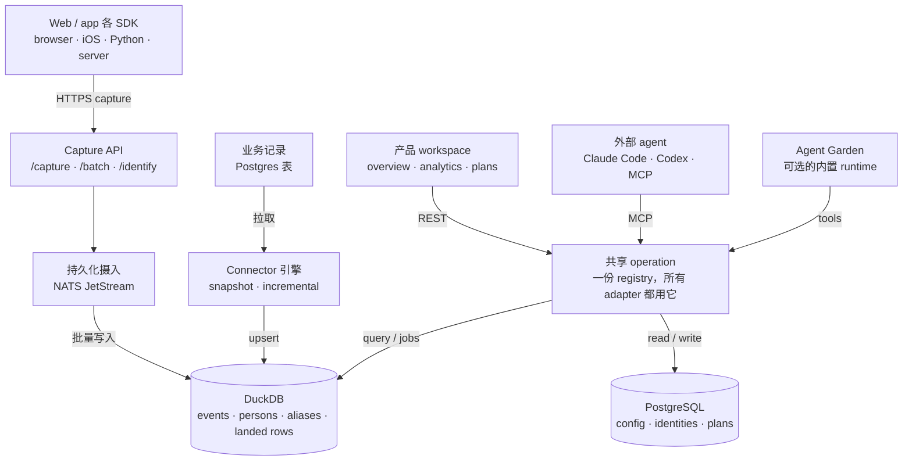

# AgentRay

[English](README.md) · [Tiếng Việt](README.vi.md) · [中文](README.cn.md) · [日本語](README.jp.md) · [한국어](README.kr.md)

**开源产品分析，交付的是一个决定，不是又一块 dashboard。**

AgentRay 把产品行为和业务数据变成营销和运营决策。接上一个网站或 app，看
到一份可信的产品总览，然后用你顺手的 agent——Claude Code、Codex，或者内置
的那个——去查问题、去改。切口刻意开得很窄：**埋点 → 理解 → 挑一个可衡量的
改进。**

任何分析工具都能告诉你*发生了什么*。真正要紧的那段活——*衡量 → 诊断 → 试验
→ 复盘*——往往落在一个根本没时间跑它的人头上，于是循环卡在图表那一步。
AgentRay 把这段循环本身做成了产品：画图用的同一份 event store，也拿去回答
你的 agent，从一次性的产品问题，到定时跑、无人值守的 growth loop。

底下是一整套产品分析底座，一条 `docker compose up` 就能自托管：Go 摄入
层、内置 DuckDB、控制面用 Postgres、PostHog 兼容的 capture，以及
browser、iOS、Python 和服务端 SDK。

## 三层结构

| 层 | 负责什么 |
|---|---|
| **数据** | 采集 event；同步业务记录；维护身份、schema、新鲜度和血缘 |
| **理解** | 预置指标、dashboard、funnel、retention、person、可复用的 audience |
| **决策与执行** | 有证据支撑的 plan，以及运营排查 |

基础分析和初始化**不需要 model key，也不需要装 agent**。这是硬要求，不是
退路：确定性的总览、dashboard 和 SDK 校验，全都只靠 event store 就能跑起
来。

## 架构



这张图的可交互版本——每个组件的细节、明暗两套主题——在
[`docs/redesign/architecture.html`](docs/redesign/architecture.html)（源
文
件：[`architecture.json`](docs/redesign/architecture.json)，receipt：[`architecture.receipt.json`](docs/redesign/architecture.receipt.json)）。背
后产品和存储上的推理见
[`docs/redesign/strategy.md`](docs/redesign/strategy.md)。

### 代码地图

后端分四层——**channels → workloads → runtime → dataplane**——外加
`internal/shared` 和一个组合根。层的映射、import 规则，以及强制这些规则
的 `TestLayerImportRules`，都在
[`docs/ARCHITECTURE.md`](docs/ARCHITECTURE.md)。

| 层 | 路径 | 职责 |
|---|---|---|
| Channels | `internal/channels` | 什么能起活：`chat`、`mcp`、`schedule`、`webhook`、`lab`（预留：`support_widget`、`voice`） |
| Workloads | `internal/workloads` | agent pack 只是配置：`validate`、`growth`、`marketing`、`data`、`operator`（预留：`support`） |
| Runtime | `internal/runtime` | AgentGarden、`agentcore` 循环、policy、sandbox |
| Dataplane | `internal/dataplane` | `ingest` · `connector` · `store` · `usecase` · `alerting` |

`agentcore/` 和 `sandbox/` 留在 module 根目录，作为对外的 runtime
库。Garden 的设计和 agent 团队模型见
[`docs/ARCHITECT-AGENTGARDEN.md`](docs/ARCHITECT-AGENTGARDEN.md) 和
[`docs/ARCHITECT-AGENT-TEAM.md`](docs/ARCHITECT-AGENT-TEAM.md)。

这里刻意**不做**的事：拆成三个产品（growth / ops / CS）、把 `agentcore`/
`sandbox` 挪位置、或者做一个 CDP。只有一个 runtime、一个 data
plane，pack 和 channel 都是配置加 adapter。

## 导航入口

登录后的首页是 `/overview`——一份确定性的产品读数，不是一个聊天框。导航用
的是产品负责人认得出的活，不是背后服务它的那一层
（[`web/lib/ia.ts`](web/lib/ia.ts)）：

| 入口 | 干什么 | 也能从这进 |
|---|---|---|
| **Overview** `/overview` | 看懂用量、转化、retention 和数据新鲜度 | |
| **Analytics** `/dashboard` | 探索获客、活跃、funnel、retention；保存 dashboard | `/traffic` · `/product` · `/templates` · `/sql` · `/web-analytics` |
| **People** `/persons` | 查看某人的行为和业务属性；保存 audience | `/cohorts` |
| **Data** `/events` | 接 SDK 和数据源；查看 event、dataset 和管道健康度 | `/start` · `/replay` |
| **Plans** `/plans` | 存放结论、证据、待验证的实验和结果 | |
| **Agents** `/agents` | 接外部 agent；chat、operations、Garden、marketplace | `/chat` · `/operations` · `/marketplace` · `/teams` · `/monitor` |
| **Settings** `/settings` | workspace 权限、凭证、retention 和用量 | `/alerts` · `/pricing`（仅托管版） |

改版前的 URL 全都还能解析：老的顶级入口，要么变成新入口上的一个别名，要
么沉成它下面的子页面。唯一的例外是 `/prototypes`，它永久重定向到
`/plans` —— 同一份测试列表，只是换了产品里的名字。存好的布局不会挪。
页面还没做出来的入口，渲染成一个不可点的“Coming soon”占位，绝不给路由接不住的
链接。

## 可信的数字

这个产品的承重规则：**来源没验证的指标，就如实显示它的状态，绝不编一个 0
出来。**

- `Set up` — 这项能力还没埋点；文案里写清需要埋什么。
- `Not ready` — cohort 还太嫩，答不了（第 2 天问 D7）。
- `No data` — 选中的范围里什么都没有，就照实说。
- `Not available` — 这个问题按当前的问法答不了，而不是硬答错（不同币种做
  对比，背后并没有汇率）。
- `Stale` — 最后一次已知的数字继续显示，打上“As of …”时间戳，并点名受
  影响的指标。

日界线只有一个约定：项目时区。比率绝不会把真实的转化率抹成 `0%`——4,783
里的 16 就是 0.3%，不是零——趋势图还会带一份文字版。这条在 UI 自己的
helper 里兜底（`formatRate`、`metricTile`），不是交给每个面板自己去处
理。

## 一层能力，所有 agent

只有**一份 operation registry**
（[`internal/shared/opcore`](internal/shared/opcore)，由
[`internal/dataplane/usecase/analytics.go`](internal/dataplane/usecase/analytics.go)
填充），每个界面都是它的一次投影：

| Adapter | 界面 |
|---|---|
| REST | `POST /api/op/<operation>` |
| MCP | `POST /mcp`（JSON-RPC 2.0） |
| 进程内 agent tool | `opcore.Tools` → `agentcore.Tool` |
| CLI | `agentray <operation> '<json>'` |

所以加一个 operation，等于一次加到 web app、MCP server、应用内 agent 和
CLI 上。registry 覆盖分析
（`activity_summary`、`recent_events`、`explore_events`、`persons`、`overview`、`run_insight`、`run_funnel`、`run_retention`、`run_sql`），dashboard
和 chart（`list_dashboards` … `archive_chart`），数据源
（`test_source`、`preview_source`、`run_source`、`source_status`、`cancel_source_run`），以
及 Plans
（`submit_recommendation`、`propose_test`、`update_test`、`record_outcome`、`abandon_test`、`list_findings`、`list_tests`），另
外还有 `remember`、`send_notification` 和 `verify_sdk`。

### 两套凭证，各管各的

**capture key** 只负责喂 event，一个 operation 都跑不了。operation 用带
scope、可吊销的 **management credential**（`agm_…`）鉴权，只以 SHA-256
哈希存着，创建时只显示一次。

| Scope | 授予什么 |
|---|---|
| `analytics:read` | 摘要、event 读取、insight、funnel、retention、dashboard 列表、SDK 校验 |
| `dashboards:write` | 编写和调整 dashboard、chart，以及归档 |
| `sources:read` | 探测、预览、状态 |
| `sources:manage` | 创建、更新、暂停、运行、取消（隐含 `sources:read`） |
| `plans:write` | 结论和实验：提交、提议、更新、记录结果、放弃 |
| `growth:write` | memory 和 notification 写入（`remember`、`send_notification`） |

鉴权顺序是确定的，而且绝不降级：management credential 优先，然后是项目
API key，最后才是 session cookie；一个带 `Bearer`、却不是合法 `agm_` 凭
证的请求，会**直接被拒**，而不是滑到更宽的身份上去。新项目一出生就是拆分
好的，所以 capture key 从第一天起就只能 capture。拆分之前的老
（“legacy”）项目，在一个冻结的 allowlist 下继续用原来的 key 做管理，直到
`POST /api/projects/:project_id/credential-split` 把它们迁过去。迁的前提
是至少已经有一个活着的凭证，因为没有凭证就拆，会把所有靠 key 鉴权的客户
端全废掉。

## 业务数据

Event 和同步进来的记录是故意分开的。一条订单行是当前的业务状态，一个
`order_paid` event 是某个时刻的事实。不先约好粒度和身份就 join，双重计数
就是这么做出来的。

connector 引擎
（[`internal/dataplane/connector`](internal/dataplane/connector)）自带一
个 **PostgreSQL** 数据源。同步按 keyset 翻页，可安全重试：

- **Incremental** — 一个 cursor 列加一个主键 tiebreak，跑到哪停的，下次
  接着跑。
- **Snapshot** — 没有 cursor 列：每次跑都把整张表重拉一遍，按
  `(project, connector, table, row_key)` 去重。撞到批次上限会报截断，而
  不是悄悄落下一张残缺的表。

落地的行放在 DuckDB 的 `external_rows` 里，**和 event 走同一条 durable
stream**，所以 blue-green 切颜色时会像 event 一样重放它们，而不是弄
丢。轮询时间戳发现不了硬删除：要么上 tombstone 流，要么定期对账，CDC 在
有之前不对外宣传。

## SDK

四个客户端，都是 **v0.1.0**，现在就能从 GitHub Releases 装上：不用
registry 账号，不用鉴权。`npm install @agentray/browser` 和
`pip install agentray` 现在还是 404：`@agentray` 这个 npm scope 和
`agentray` 这个 PyPI 名字都还没被占，所以 release 里挂的是真的 tarball
和 wheel。按 URL 装（下面每节都写了怎么装），或者贴那段免 npm 的
snippet，再或者把源码拷进产品仓库。

Swift 是例外，而且是故意的：SwiftPM 只从仓库*根目录*解析
`Package.swift`，所以 Swift SDK 自己一个仓库
[lohi-ai/agentray-swift](https://github.com/lohi-ai/agentray-swift)，在
这里以 submodule 的形式挂在 `sdk/swift/`。跑
`git submodule update --init sdk/swift` 拿到它；它自己构建、自己测试、自
己发版。

`make sdk-check` 会把每个客户端的测试和构建都跑一遍，并断言发布出去的产
物里真有这份代码。发版流
程：[docs/RELEASING-SDK.md](docs/RELEASING-SDK.md)。

**每个 SDK 都会打上 `platform` 属性**（`web` / `ios` / `android` /
`server`），Traffic 的平台拆分和分平台 funnel 读的就是它。见下文
[“这个 event 来自哪个 app？”](#这个-event-来自哪个-app)。

**Browser——不用 npm。** 贴在 `</body>` 前面（Framer、Carrd、Webflow，或
者一个普通 HTML 文件）。源文
件：`web/modules/start/components/instrument-snippet.tsx`。

```html
<script>
(function () {
  var HOST = 'https://agentray.example.com';
  var KEY  = 'YOUR_PROJECT_API_KEY';
  var id = localStorage.getItem('ar_id');
  if (!id) { id = 'a-' + Math.random().toString(36).slice(2) + Date.now().toString(36); localStorage.setItem('ar_id', id); }
  function send(event, props) {
    fetch(HOST + '/capture', {
      method: 'POST',
      headers: { 'Content-Type': 'application/json' },
      body: JSON.stringify({
        api_key: KEY, event: event, distinct_id: id,
        properties: Object.assign({ '$referrer': document.referrer, '$current_url': location.href }, props || {})
      }),
      keepalive: true
    });
  }
  send('user.pageview', { title: document.title, path: location.pathname });
})();
</script>
```

有构建步骤时，从最新的
[`browser-v*` release](https://github.com/lohi-ai/agentray/releases?q=browser)
装发布的 tarball——等 npm scope 拿到手，就能
`npm install @agentray/browser`：

```bash
npm install https://github.com/lohi-ai/agentray/releases/download/browser-v0.1.0/agentray-browser-0.1.0.tgz
```


```ts
import { init } from '@agentray/browser';

const ar = init({ host: 'https://agentray.example.com', apiKey: 'phc_...', autocapture: true });
ar.capture('user.pageview', { path: location.pathname });
ar.identify('user-123', { email: 'alice@example.com' });
```

Autocapture 零依赖，也不绑框架：每个页面都会上报 pageview
（`user.pageview`，Web analytics 那个 tab 就靠它）、委托出去的 click
（`$autocapture`），以及 `[data-track-view]` 的可见性
（`element_viewed`），一个按钮都不用单独接线。标记约
定：`data-track="label"` 让一个元素带着显式 label 进入 click
capture，`data-track-ignore` 静音一整棵子树，`data-track-view="label"`
在元素至少露出一半时触发一次 `element_viewed`。见
`sdk/browser/README.md`。

**iOS / Apple——`sdk/swift/`。** 一个 Swift Package（SPM），单独放一个仓
库，好让 SwiftPM 能解析
它：`.package(url: "https://github.com/lohi-ai/agentray-swift.git", from: "0.1.0")`。也
可以按路径加进来，或者从应用内的 **iOS app** tab 贴单文件版本
（Dashboards → Send your first event，或者 Set up）。它存在的理由：原生
app 和你的网站用同一个 key 发同一批 event，而要让两边可比，得满足三件
事：一个能扛过重启的 device id；一次 `identify`，把匿名那段时间的历史
alias 过来，免得一个人算成两个人；以及每个 event 都带
`platform: ios`，好让 Traffic 和 Product 的 funnel 把两拨 audience 分
开。见 `sdk/swift/README.md`。

```swift
import AgentRay

AgentRay.start(host: "https://agentray.example.com", apiKey: "agentray_…")
AgentRay.shared.screen("Library")               // sends user.pageview
AgentRay.shared.capture("user.signup", properties: ["plan": "free"])
AgentRay.shared.identify("user_123", traits: ["email": "alice@example.com"])
AgentRay.shared.reset()                          // on logout
```

**Python——`sdk/python/`。**
`pip install https://github.com/lohi-ai/agentray/releases/download/python-v0.1.0/agentray-0.1.0-py3-none-any.whl`
（等 PyPI 名字拿到手就是 `pip install agentray`）。服务端非阻塞上报，后
面跟着一个批量线程；PostHog 兼容的 payload：

```python
from agentray import Client
ar = Client(host="https://agentray.example.com", api_key="phc_...")
ar.capture("order_paid", distinct_id="user-123", properties={"amount": 29})
ar.flush()
```

**Node/Bun 服务端——`sdk/server/`。**
`npm install https://github.com/lohi-ai/agentray/releases/download/server-v0.1.0/agentray-server-0.1.0.tgz`
（等 npm scope 拿到手就是 `@agentray/server`）。可 await、幂等的
capture，专门给那些不能交给浏览器发的事件——支付、订阅、退款：

```ts
import { AgentRayServerClient } from '@agentray/server';
const ar = new AgentRayServerClient({ apiUrl: process.env.AGENTRAY_URL!, apiKey: process.env.AGENTRAY_API_KEY! });
// amount is an integer in the smallest unit of currency (1900 = $19.00), and
// both money methods require a stable idempotency key.
await ar.revenue('user-123', { amount: 1900, currency: 'USD', kind: 'payment' }, { idempotencyKey: webhook.id });
await ar.revenueReversed('user-123', { amount: 1900, currency: 'USD' }, { idempotencyKey: `refund:${refund.id}` });
```

每个 SDK 说的都是同一套 `capture` / `batch` / `identify` payload，所以从
PostHog 迁过来，只改一个 host。

### 这个 event 来自哪个 app？

每个 event 都带一个 `platform`——`web`、`ios`、`android` 或 `server`。每
个 SDK 自己声明它是哪个，而显式写出来的 `platform` 属性（或者 PostHog 风
格的 `$platform` / `$os`）永远优先。实在没人说，才轮到 user agent 判
断，所以在这套东西之前发出去的 event 也能分对类。iPhone 上的 Safari 是
`web`，你 app 里一次 URLSession 调用是 `ios`：分的是*哪个 app*，不是哪台
设备。

推断只是兜底，永远不是约定：某个 runtime 的 user agent 不是稳定接
口。Node 的全局 `fetch` 发出去的就是光秃秃一个 `node`，所以在客户端开始
自报家门之前，所有服务端发的 event，连 revenue 在内，都落进了
“unknown”。

Traffic 里有一块 **By platform** 面板（点一行就把整页按它收窄），Product
的 funnel 会按平台各来一遍，而且只要有第二个平台开始上报，filter bar 里
就长出一个 **Platform** facet。在 SQL 里它就是普通一
列：`WHERE platform = 'ios'`。

## CLI

`cmd/cli` 构建出 `agentray` 二进制（`make cli`，或者
`go install github.com/lohi-ai/agentray/cmd/cli@latest`）。从零就能自
助：agent 可以不打开 web app，自己建账号、自己拿项目 API key：

```sh
agentray signup --email you@example.com          # account + workspace + project
agentray login  --email you@example.com          # session saved to ~/.agentray
export AGENTRAY_API_KEY=$(agentray key)          # bare key on stdout
agentray key --rotate                            # rotate and print the new key
agentray projects                                # list projects; `whoami`, `logout`
```

密码来自 `--password`、`AGENTRAY_PASSWORD`，或者一个隐藏的 prompt。登录
之后，存下来的 server URL 和项目 key 就成了默认值，所以每条 operation 都
能零参数跑：

```sh
agentray ops                                     # list operations + schemas
agentray activity_summary '{"hours":24}'
agentray run_sql '{"sql":"SELECT count() FROM events"}'
```

`agentray key` 故意打印 **capture** key，因为那是 SDK 的用法
（`export AGENTRAY_API_KEY=$(agentray key)`），把一个私有的、带 scope 的
secret 打进 SDK config 是个错误的默认值。operation 用的是 CLI 在登录时为
每个项目 mint 一次、存在同一个 `0600` config 里的 management
credential：mint 只有 owner/admin 能做；member 照样能登录、照
样拿到 capture key，并且会被明确告知，在 owner 或 admin mint 出凭证之
前，operation 一律拒绝。

**凭证只吊销，不遗弃。** 切到另一个项目
（`agentray key --project <name>`）时，会先把正在离开的那个项目绑定的凭
证吊销，再让新的选择顶上来；`agentray logout` 也是先吊销凭证再退 session
——吊销的授权正来自这个 session。只有服务端确认了，吊销才算数：delete 路
由对被拒和已经吊销过的行都回同一个 `403`，所以由 member 可读的凭证列表来
定夺。拿不到这个证明时，命令就停住，凭证继续留在 config 里等重试，而不是
悄悄丢下一个还能用的 key。

## AI agent 与 MCP

AgentRay 通过 `POST /mcp` 上的一个 **MCP server**，把 operation 暴露给外
部 AI agent（Claude Code、Codex、任何 MCP 客户端）：JSON-RPC 2.0，只有
tool。agent 可以读活动，在你的 event 上跑 funnel / retention / SQL，把
dashboard 钉住；和应用内 agent、web 客户端用的是同一批 operation，不用再
学第二套 API。`tools/list` 只列出调用方凭证能调的东西，`tools/call` 按名
字再鉴一次权。

**鉴权用的是 management credential，不是 capture key。** capture key 直
接被拒，因为那等于谁捡到网页里嵌的那把 key，谁就能改你的 dashboard。先
mint 一个带 scope 的 `agm_…` 凭证（owner/admin；secret 只显示一次）：

```sh
curl -X POST https://agentray.lohi2.com/api/projects/$PROJECT_ID/credentials \
  -H 'Content-Type: application/json' --cookie "$SESSION" \
  -d '{"name":"claude-code","scopes":["analytics:read","dashboards:write"]}'
```

然后连接：

```sh
claude mcp add --transport http --header "Authorization: Bearer <agm_…>" \
  agentray https://agentray.lohi2.com/mcp
```

Codex：

```sh
codex mcp add agentray --url https://agentray.lohi2.com/mcp \
  --header "Authorization: Bearer <agm_…>"
```

自托管：把 host 换成你自己的实例（比如 `http://localhost:8088/mcp`）。已
登录的浏览器 session 也能鉴权，应用内 agent 就是靠它用到同一批
operation，不用第二个凭证。带 `Bearer` 但不是 `agm_` 凭证的，直接拒，不
降级到 session。凭证拆分之前就存在的项目，在冻结的 legacy allowlist 下还
能在这里用它的项目 key。

### Agent Skills

给 Claude Code / Codex 复用的工作流指南在
[`.agents/skills/`](.agents/skills)。它们教 agent 怎么驱动上面这个 MCP：

- `agentray-setup` — 端到端接入一个 app，顺序别错：项目 + API key（web
  app，或者 CLI 的 `agentray signup`/`key`）、装 SDK、event 埋点约
  定、dashboard、agent。
- `agentray-instrument` — 设计 tracking plan：埋哪些 event，每个凭什么值
  得埋，以及在埋之前就给每个 event 定好谁来消费（chart、问 AI 的问
  题、SQL、alert）。
- `agentray-analytics` — 有问题先从这里开始；先连上，然后用真实 event 数
  据回答产品问题，把 dashboard 钉住。
- `agentray-growth-loop` — 跑完一整轮 measure → diagnose → hypothesize →
  recommend → remember：找出 funnel 最弱的一环，设计最小、可回滚的实
  验，带着证据提交。
- `agentray-funnel-retention` — 搭一条转化 funnel 或一份 retention 读
  数，钉住。
- `agentray-incident-triage` — 从活动数据和原始 event 里查错误尖
  峰、latency 或成本回归。

把它们装进你 agent 的 skills 目录：

```sh
# Claude Code
mkdir -p ~/.claude/skills && cp -R .agents/skills/* ~/.claude/skills/

# Codex
mkdir -p ~/.codex/skills && cp -R .agents/skills/* ~/.codex/skills/
```

## 本地开发

[`docs/QUICKSTART.md`](docs/QUICKSTART.md) 是那条有人带的路：clone、第一
个真实 event、agent 的第一个回答，大约 15 分钟。手动版：

起完整的本地服务栈：

```bash
docker compose up --build -d
```

服务会暴露在你机器上：

- API：`http://localhost:8088`
- Dashboard web：`http://localhost:3200`
- PostgreSQL：`localhost:5434`
- Redis：`localhost:6389`
- NATS：`localhost:4223`

默认的本地项目 token：

```text
lohi_dev_project_token
```

发一个冒烟 event：

```bash
curl -s http://localhost:8088/capture \
  -H 'Content-Type: application/json' \
  -d '{
    "api_key": "lohi_dev_project_token",
    "event": "agent.tool_call",
    "distinct_id": "local-user",
    "session_id": "session-1",
    "properties": {
      "tool_name": "search",
      "latency_ms": 120,
      "tokens_input": 42,
      "tokens_output": 11
    }
  }'
```

看最近的 event：

```bash
curl -s 'http://localhost:8088/api/events?api_key=lohi_dev_project_token&limit=10'
```

看最近的 session：

```bash
curl -s 'http://localhost:8088/api/sessions?api_key=lohi_dev_project_token&limit=10'
```

打开 dashboard：

```bash
open http://localhost:3200
```

不用 Docker，单独跑 API 或 dashboard：

```bash
make dev                                         # Go API with air hot reload
cd web && pnpm install && pnpm dev               # Next.js on :3200
```

## 数据摄入

```text
HTTP API → Redis rate limit → NATS JetStream (durable) → batched writer → DuckDB
```

broker 一确认消息，API 就返回，不等 DuckDB 真拿到——慢写入就是这样被挡在
请求路径之外的。一个 durable consumer 成批写入，写进去了才 ack，所以
consumer 的 ack 水位*就是* store 的位置。`POST /capture`、`/batch` 和
`/identify` 都和 PostHog 兼容，`api_key` 和 `token` 都能鉴权一个项目。兼
容别名 `/e/`、`/e`、`/i/v0/e/`、`/i/v0/e` 都收；`/i/v0/e*` 这一对走的是
batch handler，所以它要的是 `batch` 数组，不是单个 event。

每个新项目（注册、在 workspace 里建项目、以及默认的本地项目）都会自动种
上一个“Product overview”dashboard，里面四张预置 chart——event 趋势、top
event、session、agent 成本——所以还没建任何自定义 chart，Dashboards 那个
tab 就已经给得出一个读得懂的答案。

## 存储

| 存储 | 放什么 |
|---|---|
| **DuckDB**（嵌入式，每个部署颜色一个文件） | `events`、`persons`、`aliases`、`external_rows`、`ingest_position`，以及一个 `sessions` view，event 一到就把 session 聚合往前滚 |
| **PostgreSQL** | 用户、session、workspace、项目与 API key、dashboard、chart、存下来的 query、connector、agent、Plans |

DuckDB 是单写者 MVCC：写入经过一个单槽闸门串行化，读取只放有限个快照
reader 进来，所以一个 dashboard 里并行的 tile 卡不住文件，排队的 reader
也饿不死写者。不可信的 agent SQL 跑在**独立的子进程**里，用自己的内存数
据库，里面只有那个项目的行——没有文件、没有网络、没有凭证——因为一条只允许
SELECT 的正则算不上租户边界。

每天扫一次，删掉早于 `EVENT_RETENTION_DAYS` 的 event（默认 365；`0` 表示
全留）。这只限制 event 日志能活多久，管不了文件长多大：同一个文件里还放
着 `persons`、`aliases` 和 connector 落地的行，这些扫描都不碰，所以磁盘
容量还是得盯着。

选 DuckDB 这件事本身——包括 [`storage-evaluation/`](storage-evaluation/)
下那份可复现的对比 harness，以及它明确标着 NOT RUN 的几道门——记在
[`docs/redesign/strategy.md`](docs/redesign/strategy.md)。实际建成的数据
通路，capture → store → analytics → agent，见
[`docs/DESIGN-DATA-ARCHITECTURE.md`](docs/DESIGN-DATA-ARCHITECTURE.md)。

## 部署

`infra/gce/deploy.sh --env <dev|prod>` 在 Caddy 后面把 VM 做 blue-green
滚动。一次 deploy 先起那个*没在服务*的颜色，等它报健康，再切
upstream；构建坏掉的版本一个请求都收不到，回滚就是别切。

healthcheck 打的是 `/readyz`，不是 `/healthz`，而这道门是**数据一致性**
门。新起的颜色在首次启动时重放 durable stream，在把所有行都应用完之
前，它一律回 `503`——因为一个还在重放的颜色，会拿一个中间有洞的 DuckDB 文
件去服务查询。每个颜色有自己的文件和自己的 durable；共用文件会把进来的颜
色锁在门外，共用 volume 会把它写坏。`/readyz` 拒绝时会给出原因，其中三个
原因等再久也不会消失（`purged-gap`、`store-behind`、`stream-mismatch`）
——部署脚本的头注释写了每个是什么意思、该由谁来处理。

## 端到端测试

在宿主机上跑 e2e 测试：

```bash
go test -tags=e2e ./internal/app -run TestAnalyticsServiceE2E -count=1 -v
```

如果你在容器里跑这个测试，而它连的是宿主机的 Docker daemon，就把它指回宿
主机发布的端口：

```bash
AGENTRAY_E2E_INFRA_HOST=host.docker.internal \
  go test -tags=e2e ./internal/app -run TestAnalyticsServiceE2E -count=1 -v
```

## 校验

```bash
make check                                       # go vet + the deterministic unit suite
cd web && pnpm test && pnpm lint                  # dashboard app
make sdk-check                                    # browser + server + python + swift
```

`make check` 不需要任何凭证：真 provider 的那些 agent 测试会跳过，除非设
了 `AGENTRAY_TEST_OPENAI_*`（`make test-agents` 才会真跑它们）。

## 依赖基线

AgentRay 瞄的是 Go `1.25`，以及容器构建里验证过的这套依赖：

- `github.com/duckdb/duckdb-go/v2 v2.10505.0`
- `github.com/jackc/pgx/v5 v5.10.0`
- `github.com/labstack/echo/v4 v4.15.2`
- `github.com/nats-io/nats.go v1.52.0`
- `github.com/redis/go-redis/v9 v9.20.0`
- Next.js `16.1.6`、React `19.2.3`，以及 `web/` 里的 Apache ECharts
  `6.1.0`

## 把 agent runtime 当库用

驱动 AgentRay growth loop 的那个 runtime，导出成两个可以单独 import 的
Go 包：

- [`agentcore`](agentcore/) — 与 provider 无关的 agent 循环
  （Anthropic，或任何 OpenAI 兼容网关），带 progressive-disclosure
  skill、tool policy、budget 闸门和 context compaction。
- [`sandbox`](sandbox/) — workspace tool
  （`read_file`、`grep`、`glob`、`web_fetch`），让 agent 在仓库里有据可
  依。

```bash
go get github.com/lohi-ai/agentray@latest
```

[Swatter](https://github.com/lohi-ai/swatter)，那个验证过的 PR review
bugbot，完全建在这两个包上。

## 许可证

MIT
