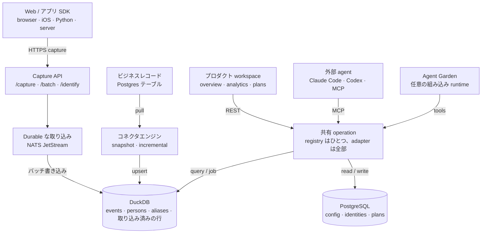

# AgentRay

[English](README.md) · [Tiếng Việt](README.vi.md) · [中文](README.cn.md) · [日本語](README.jp.md) · [한국어](README.kr.md)

**dashboard ではなく、意思決定で終わるオープンソースのプロダクト分析。**

AgentRay はプロダクトの行動データとビジネスデータを、マーケティングと運用の
意思決定に変える。サイトかアプリをつなぎ、信用できるプロダクトの全体像を見た
ら、あとは好みの agent —— Claude Code、Codex、組み込みのもの —— に調査と改善
を任せる。狙いはわざと狭い：**instrument → understand → 測れる改善をひとつ選
ぶ。**

どんな分析ツールでも *何が起きたか* は分かる。本当に効くのはその先の
*measure → diagnose → test → learn* だが、これを回す時間のある人間はたいてい
いないので、ループはチャートの前で止まる。AgentRay はそのループ自体を製品に
した：チャートを描いているのと同じ event store が、単発のプロダクトの疑問か
らスケジュールで無人で回る growth loop まで、agent の問いにも答える。

土台は `docker compose up` 一発でセルフホストできる、ひととおり揃った
プロダクト分析基盤だ —— Go の取り込み、組み込み DuckDB、control plane 用の
Postgres、PostHog 互換の capture、そして browser / iOS / Python / server 向
けの SDK。

## 3つのレイヤー

| レイヤー | 受け持つもの |
|---|---|
| **データ** | event を capture する。ビジネスレコードを同期する。identity、schema、鮮度、lineage を保つ |
| **理解** | 定義済みの metric、dashboard、funnel、retention、people、使い回せる audience |
| **意思決定と作業** | 根拠のある plan と、運用のための調査 |

基本的な分析とセットアップは、**model key なし、agent 未インストールでも**動
く。これは代替手段ではなく要件だ：deterministic な overview、dashboard、SDK
の検証は、どれも event store だけで完結する。

## アーキテクチャ



操作できる版の図 —— コンポーネントごとの詳細、light / dark テーマ付き —— は
[`docs/redesign/architecture.html`](docs/redesign/architecture.html)（source：
[`architecture.json`](docs/redesign/architecture.json)、receipt：
[`architecture.receipt.json`](docs/redesign/architecture.receipt.json)）。そ
の裏にあるプロダクトとストレージの判断は
[`docs/redesign/strategy.md`](docs/redesign/strategy.md) にある。

### コードマップ

バックエンドは 4 つの層 —— **channels → workloads → runtime → dataplane** ——
に `internal/shared` と composition root を足したものだ。対応表、import の
ルール、それを強制する `TestLayerImportRules` は
[`docs/ARCHITECTURE.md`](docs/ARCHITECTURE.md) にある。

| レイヤー | パス | 役割 |
|---|---|---|
| Channels | `internal/channels` | 何が仕事を始めるか：`chat`、`mcp`、`schedule`、`webhook`、`lab`（予約：`support_widget`、`voice`） |
| Workloads | `internal/workloads` | agent pack を config としてだけ置く：`validate`、`growth`、`marketing`、`data`、`operator`（予約：`support`） |
| Runtime | `internal/runtime` | AgentGarden、`agentcore` ループ、policy、sandbox |
| Dataplane | `internal/dataplane` | `ingest` · `connector` · `store` · `usecase` · `alerting` |

`agentcore/` と `sandbox/` は公開 runtime ライブラリとしてモジュールルートに
残す。Garden の設計と agent チームのモデルは
[`docs/ARCHITECT-AGENTGARDEN.md`](docs/ARCHITECT-AGENTGARDEN.md) と
[`docs/ARCHITECT-AGENT-TEAM.md`](docs/ARCHITECT-AGENT-TEAM.md) にある。

ここに**あえて**置いていないもの：growth / ops / CS の 3 製品分割、
`agentcore`/`sandbox` の移設、CDP。runtime はひとつ、data plane もひとつで、
pack と channel は config と adapter として扱う。

## 画面

ログイン後の入口は `/overview` —— チャットボックスではなく、deterministic な
プロダクトの読みだ。ナビゲーションは、それを提供しているバックエンドの層では
なく、プロダクトオーナーが分かる仕事の名前で並ぶ（[`web/lib/ia.ts`](web/lib/ia.ts)）：

| 画面 | 役割 | 別の入口 |
|---|---|---|
| **Overview** `/overview` | 利用状況、conversion、retention、データの鮮度を把握する | |
| **Analytics** `/dashboard` | acquisition、engagement、funnel、retention を掘る。dashboard を保存する | `/traffic` · `/product` · `/templates` · `/sql` · `/web-analytics` |
| **People** `/persons` | person の行動とビジネス属性を見る。audience を保存する | `/cohorts` |
| **Data** `/events` | SDK と source をつなぐ。event、dataset、pipeline の状態を見る | `/start` · `/replay` |
| **Plans** `/plans` | finding、根拠、提案中の experiment、結果を残す | |
| **Agents** `/agents` | 外部 agent をつなぐ。chat、operations、Garden、marketplace | `/chat` · `/operations` · `/marketplace` · `/teams` · `/monitor` |
| **Settings** `/settings` | workspace のアクセス権、credential、retention、使用量 | `/alerts` · `/pricing`（hosted のみ） |

リニューアル前の URL はすべて今も解決する。旧トップレベルの項目は、新しい画
面の alias になるか、その下の子画面になった。唯一の例外は `/prototypes`
で、`/plans` へ恒久的にリダイレクトされる —— 同じテスト一覧の製品名だ。
保存済みのレイアウトは動かない。
ページがまだ無い画面は、リンクの付いて
いない "Coming soon" として表示される —— router が捌けないリンクは絶対に出さ
ない。

## 信用できる数字

この製品の一番効くルール：**検証済みの source を持たない metric は、その状態
を表示する。でっち上げのゼロは決して出さない。**

- `Set up` —— その機能はまだ instrument されていない。文言が、必要な
  instrumentation を名指しする。
- `Not ready` —— cohort がまだ育っていないので答えられない（2 日目に D7 は出
  せない）。
- `No data` —— 選んだ範囲に何も無い、という事実をそのまま書く。
- `Not available` —— その聞き方では答えられない metric を、間違って答えるか
  わりにこう出す（通貨が違う比較には、そもそも裏に FX レートが無い）。
- `Stale` —— 最後に分かっている数字はそのまま見せ、"As of …" の
  タイムスタンプを付け、影響を受けている metric を名指しする。

日付の境界の約束はひとつだけ：プロジェクトのタイムゾーンだ。rate は本物の
conversion を `0%` に切り下げない —— 4,783 のうち 16 は 0.3% であってゼロで
はない —— し、trend chart には文章での等価物が付く。これは各パネル任せにせず、
UI 自身の helper（`formatRate`、`metricTile`）で強制している。

## 機能レイヤーはひとつ、どの agent も同じ

**operation registry はひとつ**しかない（[`internal/shared/opcore`](internal/shared/opcore)、
中身を詰めるのは
[`internal/dataplane/usecase/analytics.go`](internal/dataplane/usecase/analytics.go)）。
すべての入口は、その射影にすぎない：

| Adapter | 入口 |
|---|---|
| REST | `POST /api/op/<operation>` |
| MCP | `POST /mcp` (JSON-RPC 2.0) |
| プロセス内 agent tool | `opcore.Tools` → `agentcore.Tool` |
| CLI | `agentray <operation> '<json>'` |

だから operation を 1 つ足せば、web アプリ、MCP サーバー、アプリ内 agent、
CLI に同時に載る。registry が持つのは analytics（`activity_summary`、
`recent_events`、`explore_events`、`persons`、`overview`、`run_insight`、
`run_funnel`、`run_retention`、`run_sql`）、dashboard と chart（`list_dashboards`
… `archive_chart`）、source（`test_source`、`preview_source`、`run_source`、
`source_status`、`cancel_source_run`）、Plans（`submit_recommendation`、
`propose_test`、`update_test`、`record_outcome`、`abandon_test`、
`list_findings`、`list_tests`）、さらに `remember`、`send_notification`、
`verify_sdk`。

### credential は 2 つ、役割も 2 つ

**capture key** は event を流し込むためのもの。operation は 1 つも実行できな
い。operation の認証には、scope 付きで revoke できる **management
credential**（`agm_…`）を使う。保存されるのは SHA-256 ハッシュだけで、作成時
に一度だけ表示される。

| Scope | 許可されるもの |
|---|---|
| `analytics:read` | summary、event の読み出し、insight、funnel、retention、dashboard 一覧、SDK の検証 |
| `dashboards:write` | dashboard と chart の作成、並べ替え、archive |
| `sources:read` | probe、preview、status |
| `sources:manage` | 作成、更新、pause、run、cancel（`sources:read` を含む） |
| `plans:write` | finding と experiment：submit、propose、update、record outcome、abandon |
| `growth:write` | memory と notification の書き込み（`remember`、`send_notification`） |

解決の順序は deterministic で、格下げはしない。management credential が勝ち、
次にプロジェクトの API key、最後に session cookie —— そして、存在するが有効
な `agm_` credential ではない `Bearer` は、より広い identity に
フォールバックさせず **その場で拒否する**。新規プロジェクトは分割済みの状態
で生まれるので、capture key は初日から capture 専用だ。分割前（"legacy"）の
プロジェクトは、凍結された allowlist の下で既存の key を管理用途に使い続けら
れる。移行は `POST /api/projects/:project_id/credential-split` で行うが、そ
の前に生きた credential が最低 1 つ要る。無いまま分割すると、key 認証で動い
ている client が全部動かなくなる。

## ビジネスデータ

event と同期済みレコードは、わざと別物として扱う。注文の行は現在のビジネス状
態で、`order_paid` という event はある時点の事実だ。grain と identity の契約
なしにこの 2 つを join すると、二重カウントが生まれる。

コネクタエンジン（[`internal/dataplane/connector`](internal/dataplane/connector)）
は **PostgreSQL** の source を同梱している。sync は keyset ページングで、
retry しても安全だ：

- **Incremental** —— cursor 列と primary key のタイブレーク。run は止まった
  ところから再開する。
- **Snapshot** —— cursor 列が無い場合。毎回テーブル全体を引き直し、
  `(project, connector, table, row_key)` で重複を落とす。batch の上限に当たっ
  たら、黙って中途半端なテーブルを取り込むのではなく、truncate したと報告す
  る。

取り込み済みの行は DuckDB の `external_rows` に置かれ、**event と同じ
durable stream に乗る**。だから blue-green で側を切り替えても、event とまっ
たく同じように replay され、消えない。timestamp のポーリングでは hard delete
は見つけられない。tombstone の feed か定期照合が要る。CDC は、実物ができるま
で名乗らない。

## SDK

client は 4 つ、すべて **v0.1.0**、今日から GitHub Releases で入る ——
registry アカウントも認証も要らない。`npm install @agentray/browser` と
`pip install agentray` は今も 404 だ。`@agentray` の npm scope と `agentray`
の PyPI 名はまだ誰のものでもないので、release には代わりに本物の tarball と
wheel を添えてある。URL で入れるか（方法は各節に書いてある）、npm なしの
snippet を貼るか、ソースをプロダクトの repo にコピーしてほしい。

Swift は例外で、これも意図的だ。SwiftPM は `Package.swift` をリポジトリの
*root* から解決するので、Swift SDK は独立したリポジトリ
[lohi-ai/agentray-swift](https://github.com/lohi-ai/agentray-swift) にあり、
ここには `sdk/swift/` の submodule として入っている。
`git submodule update --init sdk/swift` で取得でき、build も test も release
も自分でやる。

`make sdk-check` は全 client の test と build を回し、公開物に本当にコードが
入っているかまで確かめる。release の切り方：
[docs/RELEASING-SDK.md](docs/RELEASING-SDK.md)。

**どの SDK も `platform` プロパティを刻む**（`web` / `ios` / `android` /
`server`）。Traffic のプラットフォーム別内訳と、プラットフォーム別の funnel
はこれを読んでいる。下の
["このイベントはどのアプリから来たのか？"](#このイベントはどのアプリから来たのか)
を参照。

**Browser —— npm 不要。** `</body>` の直前に貼る（Framer、Carrd、Webflow、あ
るいは素の HTML ファイル）。正は
`web/modules/start/components/instrument-snippet.tsx`。

```html
<script>
(function () {
  var HOST = 'https://agentray.example.com';
  var KEY  = 'YOUR_PROJECT_API_KEY';
  var id = localStorage.getItem('ar_id');
  if (!id) { id = 'a-' + Math.random().toString(36).slice(2) + Date.now().toString(36); localStorage.setItem('ar_id', id); }
  function send(event, props) {
    fetch(HOST + '/capture', {
      method: 'POST',
      headers: { 'Content-Type': 'application/json' },
      body: JSON.stringify({
        api_key: KEY, event: event, distinct_id: id,
        properties: Object.assign({ '$referrer': document.referrer, '$current_url': location.href }, props || {})
      }),
      keepalive: true
    });
  }
  send('user.pageview', { title: document.title, path: location.pathname });
})();
</script>
```

build step があるなら、最新の
[`browser-v*` release](https://github.com/lohi-ai/agentray/releases?q=browser)
から公開済みの tarball を入れる —— npm scope が取れたら
`npm install @agentray/browser` になる：

```bash
npm install https://github.com/lohi-ai/agentray/releases/download/browser-v0.1.0/agentray-browser-0.1.0.tgz
```


```ts
import { init } from '@agentray/browser';

const ar = init({ host: 'https://agentray.example.com', apiKey: 'phc_...', autocapture: true });
ar.capture('user.pageview', { path: location.pathname });
ar.identify('user-123', { email: 'alice@example.com' });
```

autocapture は依存ゼロで framework 非依存だ。どのページでも pageview（`user.pageview`、
Web analytics タブを動かしているのはこれ）、委任された click（`$autocapture`）、
`[data-track-view]` による可視（`element_viewed`）を、ボタンごとの配線なしで
報告する。markup の約束事：`data-track="label"` は明示ラベル付きでその要素を
click capture の対象にし、`data-track-ignore` はその下のツリーを黙らせ、
`data-track-view="label"` は要素が半分以上見えた時点で `element_viewed` を一
度だけ発火させる。`sdk/browser/README.md` を参照。

**iOS / Apple —— `sdk/swift/`。** 独立したリポジトリに置かれた Swift Package
（SPM）。SwiftPM が解決できるようにそうしている：
`.package(url: "https://github.com/lohi-ai/agentray-swift.git", from: "0.1.0")`。
パスで追加してもいいし、アプリ内の **iOS app** タブ（Dashboards → Send your
first event、または Set up）にある 1 ファイル版を貼ってもいい。これがあるの
は、ネイティブアプリがサイトと同じ key で同じ event を送るためで、両者を比べ
続けるには 3 つの条件が要る：起動をまたいで生き残る device id、匿名の履歴を
alias して 1 人の人間が 2 人にならないようにする `identify`、そして Traffic
と Product の funnel が audience を分けられるよう、全 event に付く
`platform: ios` タグ。`sdk/swift/README.md` を参照。

```swift
import AgentRay

AgentRay.start(host: "https://agentray.example.com", apiKey: "agentray_…")
AgentRay.shared.screen("Library")               // sends user.pageview
AgentRay.shared.capture("user.signup", properties: ["plan": "free"])
AgentRay.shared.identify("user_123", traits: ["email": "alice@example.com"])
AgentRay.shared.reset()                          // on logout
```

**Python —— `sdk/python/`。**
`pip install https://github.com/lohi-ai/agentray/releases/download/python-v0.1.0/agentray-0.1.0-py3-none-any.whl`
（PyPI 名が取れたら `pip install agentray`）。server 側の capture は
ノンブロッキングで、裏で batch 用のスレッドが回る。PostHog 互換の payload：

```python
from agentray import Client
ar = Client(host="https://agentray.example.com", api_key="phc_...")
ar.capture("order_paid", distinct_id="user-123", properties={"amount": 29})
ar.flush()
```

**Node/Bun server —— `sdk/server/`。**
`npm install https://github.com/lohi-ai/agentray/releases/download/server-v0.1.0/agentray-server-0.1.0.tgz`
（npm scope が取れたら `@agentray/server`）。ブラウザに送らせてはいけない
event —— 支払い、サブスク、返金 —— 向けの、await できる idempotent な
capture：

```ts
import { AgentRayServerClient } from '@agentray/server';
const ar = new AgentRayServerClient({ apiUrl: process.env.AGENTRAY_URL!, apiKey: process.env.AGENTRAY_API_KEY! });
// amount is an integer in the smallest unit of currency (1900 = $19.00), and
// both money methods require a stable idempotency key.
await ar.revenue('user-123', { amount: 1900, currency: 'USD', kind: 'payment' }, { idempotencyKey: webhook.id });
await ar.revenueReversed('user-123', { amount: 1900, currency: 'USD' }, { idempotencyKey: `refund:${refund.id}` });
```

どの SDK も同じ `capture` / `batch` / `identify` の payload を話すので、
PostHog の連携は host を変えるだけで移行できる。

### このイベントはどのアプリから来たのか？

どの event も `platform` を持つ —— `web`、`ios`、`android`、`server` のいず
れか。各 SDK が自分で名乗り、明示された `platform`（または PostHog 流の
`$platform` / `$os`）プロパティが常に勝つ。どこにも書かれていないときだけ
user agent が決めるので、この仕組みより前に送られた event も分類される。
iPhone の Safari は `web`、アプリからの URLSession 呼び出しは `ios`。分ける
単位はデバイスではなく *アプリ* だ。

推測はあくまで fallback で、契約ではない —— runtime の user agent は安定した
インターフェースではない。Node のグローバル `fetch` は `node` という素の単語
を送るので、client 側が名乗り始めるまで、revenue を含む server 発の event は
すべて "unknown" に落ちていた。

Traffic には **By platform** パネルがあり（行をクリックするとページ全体が
scope される）、Product の funnel はプラットフォームごとに繰り返され、2 つ目
のプラットフォームが送り始めた瞬間に filter bar に **Platform** の facet が
生える。SQL ではただの列だ：`WHERE platform = 'ios'`。

## CLI

`cmd/cli` が `agentray` バイナリを作る（`make cli`、または
`go install github.com/lohi-ai/agentray/cmd/cli@latest`）。ゼロから自分で完
結する —— agent は web アプリを一度も開かずに、アカウントを作って
プロジェクトの API key を取れる：

```sh
agentray signup --email you@example.com          # account + workspace + project
agentray login  --email you@example.com          # session saved to ~/.agentray
export AGENTRAY_API_KEY=$(agentray key)          # bare key on stdout
agentray key --rotate                            # rotate and print the new key
agentray projects                                # list projects; `whoami`, `logout`
```

パスワードは `--password`、`AGENTRAY_PASSWORD`、または隠しプロンプトから取る。
login すると、保存された server URL とプロジェクト key が既定になるので、ど
の operation もフラグなしで動く：

```sh
agentray ops                                     # list operations + schemas
agentray activity_summary '{"hours":24}'
agentray run_sql '{"sql":"SELECT count() FROM events"}'
```

`agentray key` が **capture** key を出すのはわざとだ。それが SDK の流れ（`export AGENTRAY_API_KEY=$(agentray key)`）
であり、scope 付きの秘密を SDK の config に出すのは既定として間違っている。
operation が使うのは、CLI が login 時にプロジェクトごとに 1 回だけ発行し、同
じ `0600` の config に置いておく management credential —— 発行できるのは
owner/admin だけ。member でも login はでき、capture key も取れる。
そして、owner か admin が credential を発行するまで operation は拒否されると、
はっきり伝えられる。

**credential は捨てずに revoke する。** 別のプロジェクトを選ぶ（`agentray key --project <name>`）
と、新しい選択で置き換える前に、離れるプロジェクトに紐づいた credential を
revoke する。`agentray logout` も session より先に revoke する —— revoke を
正当化しているのは session だからだ。revoke は、サーバーが確認して初めて信じ
る。delete の route は、拒否された場合もすでに revoke 済みの行も同じ `403`
を返すので、決め手は member でも読める credential 一覧になる。その証拠が取れ
ないときは、生きた key を黙って宙に浮かせるのではなく、config に credential
を残したままコマンドを止めて、再試行できるようにする。

## AI agent と MCP

AgentRay は自分の operation を、`POST /mcp` の **MCP サーバー** 経由で外部の
AI agent（Claude Code、Codex、任意の MCP client）に公開している —— JSON-RPC
2.0、tool のみ。agent は activity を読み、自分の event に対して funnel /
retention / SQL を回し、dashboard を pin できる。アプリ内 agent と web
client が使っているのと同じ operation で、覚える API が 2 つ目に増えることは
ない。`tools/list` が広告するのは呼び出し元の credential が実行できるものだ
けで、`tools/call` は名前で再認証する。

**認証に使うのは management credential で、capture key ではない。** capture
key は問答無用で拒否される。ブラウザに埋め込まれた key を持っている誰かが、
あなたの dashboard を書き換えられてしまうからだ。まず scope 付きの `agm_…`
credential を発行する（owner/admin。秘密は一度だけ表示される）：

```sh
curl -X POST https://agentray.lohi2.com/api/projects/$PROJECT_ID/credentials \
  -H 'Content-Type: application/json' --cookie "$SESSION" \
  -d '{"name":"claude-code","scopes":["analytics:read","dashboards:write"]}'
```

あとは接続するだけ：

```sh
claude mcp add --transport http --header "Authorization: Bearer <agm_…>" \
  agentray https://agentray.lohi2.com/mcp
```

Codex:

```sh
codex mcp add agentray --url https://agentray.lohi2.com/mcp \
  --header "Authorization: Bearer <agm_…>"
```

セルフホストなら、host を自分のインスタンスに差し替える（例：
`http://localhost:8088/mcp`）。ログイン済みのブラウザ session でも認証できる。
アプリ内 agent が 2 つ目の credential なしで同じ operation に届くのは、この
経路だ。`agm_` credential ではない `Bearer` ヘッダーは、session に格下げされ
ず拒否される。credential 分割より前のプロジェクトも、凍結された legacy
allowlist の下で、ここではプロジェクト key を使える。

### Agent Skills

Claude Code / Codex 用に使い回せる workflow ガイドが
[`.agents/skills/`](.agents/skills) にある。上の MCP を agent にどう操作させ
るかを教えるものだ：

- `agentray-setup` —— アプリを端から端まで、正しい順番で組み込む：
  プロジェクト + API key（web アプリ、または `agentray signup`/`key` CLI）、
  SDK の導入、event instrumentation の契約、dashboard、agent。
- `agentray-instrument` —— tracking plan を設計する：どの event を capture
  するか、それぞれがなぜ必要なのか、そして instrument する前に全 event につ
  いて決めておく消費者（chart、ask-AI の質問、SQL、alert）。
- `agentray-analytics` —— 疑問があればまずこれ。つないだら、本物の event
  データでプロダクトの問いに答え、dashboard を pin する。
- `agentray-growth-loop` —— measure → diagnose → hypothesize → recommend →
  remember のサイクルを 1 周回す：funnel の一番弱いリンクを見つけ、最小の可
  逆な test を設計し、根拠付きで記録する。
- `agentray-funnel-retention` —— conversion funnel か retention の読みを組み
  立てて pin する。
- `agentray-incident-triage` —— error の急増、latency、コストの悪化を、
  activity と生の event から調べる。

自分の agent の skills フォルダに入れる：

```sh
# Claude Code
mkdir -p ~/.claude/skills && cp -R .agents/skills/* ~/.claude/skills/

# Codex
mkdir -p ~/.codex/skills && cp -R .agents/skills/* ~/.codex/skills/
```

## ローカル開発

[`docs/QUICKSTART.md`](docs/QUICKSTART.md) が案内付きの道筋だ —— clone、最初
の本物の event、最初の agent の答えまで、およそ 15 分。手でやるなら：

ローカルの一式を起動する：

```bash
docker compose up --build -d
```

マシンに公開されるサービス：

- API: `http://localhost:8088`
- Dashboard web: `http://localhost:3200`
- PostgreSQL: `localhost:5434`
- Redis: `localhost:6389`
- NATS: `localhost:4223`

ローカルの既定プロジェクト token：

```text
lohi_dev_project_token
```

smoke event を送る：

```bash
curl -s http://localhost:8088/capture \
  -H 'Content-Type: application/json' \
  -d '{
    "api_key": "lohi_dev_project_token",
    "event": "agent.tool_call",
    "distinct_id": "local-user",
    "session_id": "session-1",
    "properties": {
      "tool_name": "search",
      "latency_ms": 120,
      "tokens_input": 42,
      "tokens_output": 11
    }
  }'
```

直近の event を見る：

```bash
curl -s 'http://localhost:8088/api/events?api_key=lohi_dev_project_token&limit=10'
```

直近の session を見る：

```bash
curl -s 'http://localhost:8088/api/sessions?api_key=lohi_dev_project_token&limit=10'
```

dashboard を開く：

```bash
open http://localhost:3200
```

Docker なしで API か dashboard アプリを動かす：

```bash
make dev                                         # Go API with air hot reload
cd web && pnpm install && pnpm dev               # Next.js on :3200
```

## 取り込み

```text
HTTP API → Redis rate limit → NATS JetStream (durable) → batched writer → DuckDB
```

API は broker がメッセージを ack した時点で返る。DuckDB が持った時点ではない
—— これが遅い書き込みをリクエストの経路から外している。durable な consumer
が batch を適用し、書き込みが着地してから初めて ack する。つまり consumer の
ack floor が *そのまま* store の位置になる。`POST /capture`、`/batch`、
`/identify` は PostHog 互換で、`api_key` と `token` のどちらでもプロジェクト
を認証できる。互換 alias として `/e/`、`/e`、`/i/v0/e/`、`/i/v0/e` も受け付
ける。`/i/v0/e*` の 2 つは batch handler に繋がるので、単一の event ではなく
`batch` 配列を期待する。

新規プロジェクト（signup、workspace 内でのプロジェクト作成、既定の
ローカルプロジェクト）には、4 つの定義済み chart —— event の推移、上位 event、
session、agent のコスト —— を持つ "Product overview" dashboard が自動で用意
される。だから Dashboards タブは、自作の chart を 1 つも作らないうちから読め
る答えを返す。

## ストレージ

| Store | 中身 |
|---|---|
| **DuckDB**（組み込み、デプロイする側ごとに 1 ファイル） | `events`、`persons`、`aliases`、`external_rows`、`ingest_position`、そして event が届くたび session 集計を前に進める `sessions` view |
| **PostgreSQL** | ユーザー、session、workspace、プロジェクトと API key、dashboard、chart、保存済みクエリ、コネクタ、agent、Plans |

DuckDB は single-writer の MVCC だ。書き込みは 1 スロットの gate で直列化さ
れ、読みは上限付きの snapshot reader しか通さない。だから dashboard の並列
タイルがファイルを掴んだままにもできないし、待っている reader が writer を飢
えさせることもない。信頼できない agent の SQL は **別の子プロセス**で動く。
そこにはそのプロジェクトの行だけを持つ専用の in-memory database があり、
ファイルもネットワークも credential も無い —— SELECT だけを許す regex は
tenant の境界にはならないからだ。

毎日 1 回の sweep が `EVENT_RETENTION_DAYS`（既定 365。`0` なら全部残す）よ
り古い event を消す。これで抑えられるのは event ログの寿命であって、ファイル
の大きさではない。同じファイルには `persons`、`aliases`、コネクタが取り込ん
だ行も入っていて、sweep はどれも触らない。ディスク容量は依然として見張る必要
がある。

DuckDB を選んだ判断そのもの —— [`storage-evaluation/`](storage-evaluation/)
にある再現可能な比較 harness と、明示的に NOT RUN とされた gate を含む —— は
[`docs/redesign/strategy.md`](docs/redesign/strategy.md) に記録されている。
実装されたデータ経路、capture → store → analytics → agent は
[`docs/DESIGN-DATA-ARCHITECTURE.md`](docs/DESIGN-DATA-ARCHITECTURE.md)。

## デプロイ

`infra/gce/deploy.sh --env <dev|prod>` が、Caddy の裏で VM を blue-green に
切り替える。deploy は *動いていない* 側を起動し、healthy を報告するまで待っ
てから upstream を切り替える。壊れた build がリクエストを受けることはないし、
rollback は切り替えないだけだ。

healthcheck が見るのは `/healthz` ではなく `/readyz` で、この gate は **data
coherence** の gate だ。新しい側は初回起動時に durable stream を replay する。
全部の行を適用し終えるまで `503` を返す —— replay 中の側が答えると、穴の空い
た DuckDB ファイルからクエリを返すことになるからだ。それぞれの側が自分の
ファイルと自分の durable stream を持つ。ファイルを共有すると新しい側が締め出
され、volume を共有すると壊れる。`/readyz` は理由付きで拒否し、その理由のう
ち 3 つは待っても消えない（`purged-gap`、`store-behind`、`stream-mismatch`）。
それぞれの意味と運用者が何を負うかは、deploy script のヘッダーに書いてある。

## E2E テスト

e2e テストはホストマシンから回す：

```bash
go test -tags=e2e ./internal/app -run TestAnalyticsServiceE2E -count=1 -v
```

ホストの Docker daemon に繋がるコンテナの中から回す場合は、ホストが公開して
いるポートを指すようにする：

```bash
AGENTRAY_E2E_INFRA_HOST=host.docker.internal \
  go test -tags=e2e ./internal/app -run TestAnalyticsServiceE2E -count=1 -v
```

## 検証

```bash
make check                                       # go vet + the deterministic unit suite
cd web && pnpm test && pnpm lint                  # dashboard app
make sdk-check                                    # browser + server + python + swift
```

`make check` に credential は要らない。本物の provider を使う agent の test
は `AGENTRAY_TEST_OPENAI_*` が設定されていなければ skip される（`make test-agents`
なら本気で走る）。

## 依存関係のベースライン

AgentRay は Go `1.25` と、コンテナ build で検証済みの依存セットを対象にして
いる：

- `github.com/duckdb/duckdb-go/v2 v2.10505.0`
- `github.com/jackc/pgx/v5 v5.10.0`
- `github.com/labstack/echo/v4 v4.15.2`
- `github.com/nats-io/nats.go v1.52.0`
- `github.com/redis/go-redis/v9 v9.20.0`
- Next.js `16.1.6`、React `19.2.3`、`web/` 内の Apache ECharts `6.1.0`

## ライブラリとしての agent runtime

AgentRay の growth loop を動かしている runtime は、単体で import できる 2 つ
の Go パッケージとして公開している：

- [`agentcore`](agentcore/) —— provider 非依存の agent ループ（Anthropic、ま
  たは OpenAI 互換の任意の gateway）。progressive disclosure な skill、tool
  policy、budget の制御、context compaction を備える。
- [`sandbox`](sandbox/) —— agent をリポジトリに接地させるための workspace
  tool（`read_file`、`grep`、`glob`、`web_fetch`）。

```bash
go get github.com/lohi-ai/agentray@latest
```

検証済みの PR レビュー bugbot、[Swatter](https://github.com/lohi-ai/swatter)
は、この 2 つのパッケージだけで作られている。

## ライセンス

MIT
