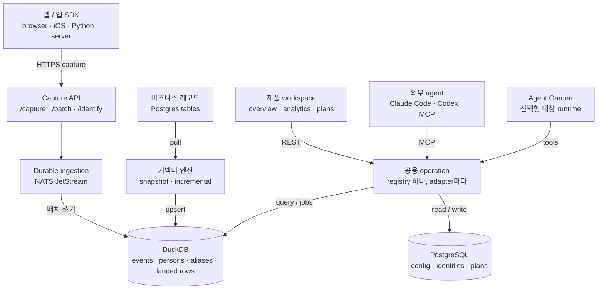

# AgentRay

[English](README.md) · [Tiếng Việt](README.vi.md) · [中文](README.cn.md) · [日本語](README.jp.md) · [한국어](README.kr.md)

**dashboard가 아니라 결정으로 끝나는 오픈소스 product analytics.**

AgentRay는 제품 활동과 비즈니스 데이터를 마케팅·운영 결정으로 바꾼다. 웹사이트나
앱을 연결하고, 믿을 만한 product overview를 확인한 다음, 선호하는 agent — Claude
Code, Codex, 또는 내장 agent — 로 파고들어 개선한다. 타깃은 일부러 좁게 잡았다:
**instrument → understand → 측정 가능한 개선 하나를 고르기.**

모든 analytics tool은 *무슨 일이 있었는지*는 알려준다. 정작 중요한 일 —
*measure → diagnose → test → learn* — 은 그걸 돌릴 시간이 없는 사람에게
떨어지고, 그래서 루프는 차트에서 멈춘다. AgentRay는 그 루프 자체를 제품으로
내놓는다: 차트를 그리는 event store가 그대로 agent의 질문에 답한다. 일회성
제품 질문부터 예약된 무인 growth loop까지.

그 아래에는 `docker compose up` 한 번으로 self-host할 수 있는 완전한
product-analytics 기반이 있다 — Go ingestion, 내장 DuckDB, control plane용
Postgres, PostHog 호환 capture, 그리고 browser·iOS·Python·server용 SDK.

## 세 개의 layer

| Layer | 담당 |
|---|---|
| **Data** | event 수집, 비즈니스 레코드 동기화, identity·schema·freshness·lineage 유지 |
| **Understanding** | 미리 정의된 metric, dashboard, funnel, retention, people, 재사용 가능한 audience |
| **Decisions and work** | 근거가 붙은 plan과 운영 조사 |

기본 analytics와 setup은 **model key 없이, agent를 설치하지 않고도** 돌아간다.
이건 요구사항이지 fallback이 아니다: deterministic overview, dashboard, SDK
verification 모두 event store만으로 돌아간다.

## 아키텍처



이 다이어그램을 직접 만져볼 수 있는 버전 — 컴포넌트별 상세, 라이트·다크 테마 — 은
[`docs/redesign/architecture.html`](docs/redesign/architecture.html) (원본:
[`architecture.json`](docs/redesign/architecture.json), 영수증:
[`architecture.receipt.json`](docs/redesign/architecture.receipt.json)). 그 뒤의
제품·storage 판단은
[`docs/redesign/strategy.md`](docs/redesign/strategy.md)에 있다.

### 코드 맵

백엔드는 네 layer다 — **channels → workloads → runtime → dataplane** — 여기에
`internal/shared`와 composition root가 붙는다. 매핑, import 규칙, 그리고 이를
강제하는 `TestLayerImportRules`는
[`docs/ARCHITECTURE.md`](docs/ARCHITECTURE.md)에 있다.

| Layer | Path | Role |
|---|---|---|
| Channels | `internal/channels` | 무엇이 작업을 시작하는가: `chat`, `mcp`, `schedule`, `webhook`, `lab` (예약: `support_widget`, `voice`) |
| Workloads | `internal/workloads` | config만으로 정의하는 Agent pack: `validate`, `growth`, `marketing`, `data`, `operator` (예약: `support`) |
| Runtime | `internal/runtime` | AgentGarden, `agentcore` loop, policy, sandbox |
| Dataplane | `internal/dataplane` | `ingest` · `connector` · `store` · `usecase` · `alerting` |

`agentcore/`와 `sandbox/`는 모듈 루트에 남아 공개 runtime library가 된다. Garden의
설계와 agent-team 모델은
[`docs/ARCHITECT-AGENTGARDEN.md`](docs/ARCHITECT-AGENTGARDEN.md),
[`docs/ARCHITECT-AGENT-TEAM.md`](docs/ARCHITECT-AGENT-TEAM.md)에 있다.

여기에 일부러 **없는** 것: 제품을 셋으로 쪼개기(growth / ops / CS),
`agentcore`/`sandbox` 옮기기, CDP. runtime 하나, data plane 하나이고 pack과
channel은 config와 adapter로 붙는다.

## 목적지

로그인 후 첫 화면은 `/overview`다 — chat box가 아니라 deterministic한 제품 요약.
내비게이션은 백엔드 layer가 아니라 product owner가 알아보는 일을 가리킨다
([`web/lib/ia.ts`](web/lib/ia.ts)):

| 목적지 | 하는 일 | 함께 갈 수 있는 곳 |
|---|---|---|
| **Overview** `/overview` | 사용량, 전환, retention, data freshness 파악 | |
| **Analytics** `/dashboard` | acquisition, engagement, funnel, retention 탐색, dashboard 저장 | `/traffic` · `/product` · `/templates` · `/sql` · `/web-analytics` |
| **People** `/persons` | 개인의 활동과 비즈니스 속성 확인, audience 저장 | `/cohorts` |
| **Data** `/events` | SDK와 source 연결, event·dataset·pipeline 상태 확인 | `/start` · `/replay` |
| **Plans** `/plans` | finding과 근거, 제안한 실험, 결과 보관 | `/prototypes` |
| **Agents** `/agents` | 외부 agent 연결, chat, operations, Garden, marketplace | `/chat` · `/operations` · `/marketplace` · `/teams` · `/monitor` |
| **Settings** `/settings` | workspace 권한, credential, retention과 사용량 | `/alerts` · `/pricing` (hosted 전용) |

리디자인 이전의 URL은 모두 그대로 열린다: 예전 최상위 항목은 새 목적지의
alias가 되거나 그 아래 child surface가 됐다. 다른 곳으로 redirect되는 것도,
저장된 layout이 움직이는 것도 없다. 페이지가 아직 없는 목적지는 링크 없는
"Coming soon" 표시로 렌더된다 — router가 열 수 없는 링크를 내놓지 않는다.

## 믿을 수 있는 숫자

이 제품을 떠받치는 규칙: **검증된 source가 없는 metric은 자기 상태를 보여준다.
지어낸 0을 보여주지 않는다.**

- `Set up` — 기능에 instrument가 안 붙었다. 안내 문구가 필요한 instrumentation을
  짚어준다.
- `Not ready` — cohort가 너무 어려서 답할 수 없다 (2일차에 물어본 D7 숫자).
- `No data` — 고른 범위에 아무것도 없다. 그렇다고 그대로 말한다.
- `Not available` — 질문 그대로는 답할 수 없는 metric이다. 틀리게 답하지 않는다
  (통화가 다른 비교에는 걸 환율이 없다).
- `Stale` — 마지막으로 알려진 수치는 그대로 보이고 "As of …" 시각이 붙는다.
  영향을 받은 metric 이름도 함께 나온다.

날짜 경계 규칙은 딱 하나다: 프로젝트 timezone. 비율은 실제 전환을 `0%`로 내림하지
않는다 — 4,783분의 16은 0.3%지 0이 아니다 — 그리고 trend 차트에는 같은 내용을
문장으로 적은 버전이 붙는다. 이건 각 panel에 맡기지 않고 UI 자체 helper
(`formatRate`, `metricTile`)에서 강제한다.

## 기능 layer 하나, 모든 agent

**operation registry는 하나뿐**이고
([`internal/shared/opcore`](internal/shared/opcore),
[`internal/dataplane/usecase/analytics.go`](internal/dataplane/usecase/analytics.go)가
채운다), 모든 surface는 그걸 투영한 것이다:

| Adapter | 노출 지점 |
|---|---|
| REST | `POST /api/op/<operation>` |
| MCP | `POST /mcp` (JSON-RPC 2.0) |
| In-process agent tools | `opcore.Tools` → `agentcore.Tool` |
| CLI | `agentray <operation> '<json>'` |

그래서 operation을 하나 추가하면 web app, MCP server, in-app agent, CLI에 한 번에
붙는다. registry가 덮는 범위는 analytics
(`activity_summary`, `recent_events`, `explore_events`, `persons`, `overview`,
`run_insight`, `run_funnel`, `run_retention`, `run_sql`), dashboard와 chart
(`list_dashboards` … `archive_chart`), source (`test_source`, `preview_source`,
`run_source`, `source_status`, `cancel_source_run`), Plans
(`submit_recommendation`, `propose_test`, `update_test`, `record_outcome`,
`abandon_test`, `list_findings`, `list_tests`), 그리고 `remember`,
`send_notification`, `verify_sdk`다.

### credential 두 개, 역할 두 개

**capture key**는 event를 넣는다. operation은 하나도 실행할 수 없다. operation은
scope가 있고 폐기할 수 있는 **management credential**(`agm_…`)로 인증한다. 이건
SHA-256 hash로만 저장되고, 만들 때 딱 한 번 보여준다.

| Scope | 허용 범위 |
|---|---|
| `analytics:read` | summary, event 조회, insight, funnel, retention, dashboard 목록, SDK verification |
| `dashboards:write` | dashboard와 chart 작성, 순서 변경, archive |
| `sources:read` | probe, preview, status |
| `sources:manage` | create, update, pause, run, cancel (`sources:read` 포함) |
| `plans:write` | finding과 실험: submit, propose, update, record outcome, abandon |
| `growth:write` | memory와 notification 쓰기 (`remember`, `send_notification`) |

판정은 deterministic하고 절대 아래로 내려가지 않는다: management credential이
이기고, 다음이 project API key, 그다음이 session cookie다 — 그리고 `Bearer`가
있는데 유효한 `agm_` credential이 아니면 더 넓은 identity로 흘려보내지 않고 **그
자리에서 거부**한다. 새 프로젝트는 처음부터 분리된 상태로 태어나므로 capture key는
첫날부터 capture 전용이다. 분리 이전("legacy") 프로젝트는 frozen allowlist 아래에서
기존 key를 management용으로 계속 쓰되,
`POST /api/projects/:project_id/credential-split`가 넘겨줄 때까지 그렇다 — 이 API는
살아 있는 credential이 최소 하나 있어야 하는데, 없이 분리하면 key로 인증하는 모든
client가 벽돌이 되기 때문이다.

## 비즈니스 데이터

event와 동기화된 레코드는 일부러 구분해 둔다. 주문 row는 지금의 비즈니스
상태고, `order_paid` event는 특정 시점의 사실이다. grain과 identity 계약 없이
둘을 join하면 중복 집계가 만들어진다.

커넥터 엔진([`internal/dataplane/connector`](internal/dataplane/connector))은
**PostgreSQL** source를 제공한다. sync는 keyset 페이지네이션이고 retry에 안전하다:

- **Incremental** — cursor column에 primary-key tiebreak를 더한다. 그래서 중단된
  지점에서 이어서 돈다.
- **Snapshot** — cursor column이 없다: 매 실행마다 테이블 전체를 다시 끌어오고
  `(project, connector, table, row_key)`로 중복을 제거한다. batch 상한에 걸리면
  조용히 일부만 적재하지 않고 잘렸다고 보고한다.

적재된 row는 DuckDB의 `external_rows`에 살고 **event와 같은 durable stream을 탄다**.
그래서 blue-green colour 전환 때도 잃어버리지 않고 event와 똑같이 replay된다.
timestamp polling으로는 hard delete를 찾을 수 없다: tombstone feed나 주기적
reconciliation이 필요하고, CDC는 실제로 생기기 전까지 광고하지 않는다.

## SDK

client는 네 개, 모두 **v0.1.0**이고 지금 GitHub Releases에서 설치할 수 있다 —
registry 계정도, 인증도 필요 없다. `npm install @agentray/browser`와
`pip install agentray`는 아직 404다: `@agentray` npm scope와 `agentray` PyPI
이름이 아직 주인 없어서, release에 실제 tarball과 wheel을 대신 붙여 둔다. 그건 URL로
설치하거나(아래 각 섹션에 방법이 있다), no-npm snippet을 붙여 넣거나, source를 제품
repo에 복사하면 된다.

Swift만 예외이고, 이건 일부러 그렇다: SwiftPM은 `Package.swift`를 repo *루트*에서
찾기 때문에 Swift SDK는 별도 repo다,
[lohi-ai/agentray-swift](https://github.com/lohi-ai/agentray-swift), 여기에는
`sdk/swift/` submodule로 들어와 있다. 받으려면
`git submodule update --init sdk/swift`를 돌린다. build, test, release를 스스로
한다.

`make sdk-check`는 모든 client의 test와 build를 돌리고, 배포된 artefact에 실제로 그
코드가 들어 있는지까지 확인한다. release 내는 법:
[docs/RELEASING-SDK.md](docs/RELEASING-SDK.md).

**모든 SDK는 `platform` property를 찍는다** (`web` / `ios` / `android` /
`server`). Traffic의 platform 분할과 platform별 funnel이 바로 이걸 읽는다. 아래
["이 event는 어느 앱에서 왔나?"](#이-event는-어느-앱에서-왔나)를 보라.

**Browser — no npm.** `</body>` 앞에 붙여 넣는다 (Framer, Carrd, Webflow, 또는
그냥 HTML 파일). 기준 source:
`web/modules/start/components/instrument-snippet.tsx`.

```html
<script>
(function () {
  var HOST = 'https://agentray.example.com';
  var KEY  = 'YOUR_PROJECT_API_KEY';
  var id = localStorage.getItem('ar_id');
  if (!id) { id = 'a-' + Math.random().toString(36).slice(2) + Date.now().toString(36); localStorage.setItem('ar_id', id); }
  function send(event, props) {
    fetch(HOST + '/capture', {
      method: 'POST',
      headers: { 'Content-Type': 'application/json' },
      body: JSON.stringify({
        api_key: KEY, event: event, distinct_id: id,
        properties: Object.assign({ '$referrer': document.referrer, '$current_url': location.href }, props || {})
      }),
      keepalive: true
    });
  }
  send('user.pageview', { title: document.title, path: location.pathname });
})();
</script>
```

build 단계가 있다면 최신
[`browser-v*` release](https://github.com/lohi-ai/agentray/releases?q=browser)의
배포된 tarball을 설치한다 — npm scope가 주인을 찾으면
`npm install @agentray/browser`:

```bash
npm install https://github.com/lohi-ai/agentray/releases/download/browser-v0.1.0/agentray-browser-0.1.0.tgz
```


```ts
import { init } from '@agentray/browser';

const ar = init({ host: 'https://agentray.example.com', apiKey: 'phc_...', autocapture: true });
ar.capture('user.pageview', { path: location.pathname });
ar.identify('user-123', { email: 'alice@example.com' });
```

Autocapture는 의존성이 없고 framework에 매이지 않는다: 모든 페이지가
pageview(`user.pageview`, Web analytics 탭을 먹여 살리는 것), delegated
click(`$autocapture`), `[data-track-view]` 노출(`element_viewed`)을 버튼마다 배선하지
않고 보고한다. markup 규칙: `data-track="label"`은 원소를 명시적 label과 함께 click
capture에 넣고, `data-track-ignore`는 하위 트리를 음소거하고,
`data-track-view="label"`은 원소가 절반 이상 보이면 `element_viewed`를 한 번
발생시킨다. `sdk/browser/README.md`를 보라.

**iOS / Apple — `sdk/swift/`.** Swift Package(SPM)이고, SwiftPM이 찾을 수 있게 별도
repository에 산다:
`.package(url: "https://github.com/lohi-ai/agentray-swift.git", from: "0.1.0")`.
path로 추가하거나, in-app의 **iOS app** 탭(Dashboards → Send your first event,
또는 Set up)에서 single-file 버전을 붙여 넣어도 된다. 이게 있는 이유는 native app이
웹사이트와 같은 key로 같은 event를 보내기 때문이고, 둘을 비교 가능하게 유지하려면 세
가지가 참이어야 한다: 앱을 다시 띄워도 살아남는 device id, 익명 기록을 alias해 한
사람이 두 사람이 되지 않게 하는 `identify`, 그리고 Traffic과 Product funnel이
audience를 갈라 볼 수 있게 모든 event에 붙는 `platform: ios` tag.
`sdk/swift/README.md`를 보라.

```swift
import AgentRay

AgentRay.start(host: "https://agentray.example.com", apiKey: "agentray_…")
AgentRay.shared.screen("Library")               // sends user.pageview
AgentRay.shared.capture("user.signup", properties: ["plan": "free"])
AgentRay.shared.identify("user_123", traits: ["email": "alice@example.com"])
AgentRay.shared.reset()                          // on logout
```

**Python — `sdk/python/`.** `pip install https://github.com/lohi-ai/agentray/releases/download/python-v0.1.0/agentray-0.1.0-py3-none-any.whl`
(`agentray` PyPI 이름이 주인을 찾으면 `pip install agentray`). background batch
thread로 도는 non-blocking server-side capture, PostHog 호환 payload:

```python
from agentray import Client
ar = Client(host="https://agentray.example.com", api_key="phc_...")
ar.capture("order_paid", distinct_id="user-123", properties={"amount": 29})
ar.flush()
```

**Node/Bun server — `sdk/server/`.** `npm install https://github.com/lohi-ai/agentray/releases/download/server-v0.1.0/agentray-server-0.1.0.tgz`
(`@agentray/server`는 npm scope가 주인을 찾으면). browser에 맡기면 안 되는 event —
결제, 구독, 환불 — 를 위한 await 가능한 idempotent capture:

```ts
import { AgentRayServerClient } from '@agentray/server';
const ar = new AgentRayServerClient({ apiUrl: process.env.AGENTRAY_URL!, apiKey: process.env.AGENTRAY_API_KEY! });
// amount is an integer in the smallest unit of currency (1900 = $19.00), and
// both money methods require a stable idempotency key.
await ar.revenue('user-123', { amount: 1900, currency: 'USD', kind: 'payment' }, { idempotencyKey: webhook.id });
await ar.revenueReversed('user-123', { amount: 1900, currency: 'USD' }, { idempotencyKey: `refund:${refund.id}` });
```

모든 SDK는 같은 `capture` / `batch` / `identify` payload를 쓴다. 그래서 PostHog
연동은 host만 바꾸면 옮겨온다.

### 이 event는 어느 앱에서 왔나?

모든 event에는 `platform`이 붙는다 — `web`, `ios`, `android`, `server`. 각 SDK가
자기 것을 밝히고, 명시된 `platform`(또는 PostHog식 `$platform` / `$os`) property가
언제나 이긴다. 아무도 말하지 않을 때만 user agent가 판단하므로, 이 기능이 생기기 전에
보낸 event도 분류된다. iPhone의 Safari는 `web`, 앱에서 보낸 URLSession 호출은
`ios`다: 기준은 기기가 아니라 *앱*이다.

추론은 fallback일 뿐 계약이 아니다 — runtime의 user agent는 안정된 interface가
아니다. Node의 전역 `fetch`는 그냥 `node`라는 단어를 보내서, client가 자기 정체를
밝히기 전까지 매출까지 포함한 모든 server 발송 event가 "unknown"에 쌓이고 있었다.

Traffic에는 **By platform** panel이 있고 (row를 클릭하면 그 platform으로 페이지가
좁혀진다), Product의 funnel은 platform마다 따로 돌고, 두 번째 platform이 보내기
시작하는 순간 filter bar에 **Platform** facet이 생긴다. SQL에서는 그냥 column이다:
`WHERE platform = 'ios'`.

## CLI

`cmd/cli`가 `agentray` binary를 만든다 (`make cli`, 또는
`go install github.com/lohi-ai/agentray/cmd/cli@latest`). 처음부터 셀프서비스다 —
agent가 web app을 열지 않고도 계정을 만들고 project API key를 받아올 수 있다:

```sh
agentray signup --email you@example.com          # account + workspace + project
agentray login  --email you@example.com          # session saved to ~/.agentray
export AGENTRAY_API_KEY=$(agentray key)          # bare key on stdout
agentray key --rotate                            # rotate and print the new key
agentray projects                                # list projects; `whoami`, `logout`
```

password는 `--password`, `AGENTRAY_PASSWORD`, 또는 숨김 prompt에서 온다. login
뒤에는 저장된 server URL과 project key가 기본값이 되므로, 모든 operation이 flag
없이 돈다:

```sh
agentray ops                                     # list operations + schemas
agentray activity_summary '{"hours":24}'
agentray run_sql '{"sql":"SELECT count() FROM events"}'
```

`agentray key`가 일부러 **capture** key를 출력한다. 그게 SDK 흐름
(`export AGENTRAY_API_KEY=$(agentray key)`)이고, private scope secret을 SDK
config에 찍어 넣는 건 잘못된 기본값이기 때문이다. operation은 CLI가 login 때
프로젝트마다 한 번 발급해서 같은 `0600` config에 보관하는 management credential을
쓴다 — 발급은 owner/admin만 할 수 있고, member도 login은 되고 capture
key도 받지만, owner나 admin이 credential을 발급하기 전까지 operation은 거부된다는
걸 분명히 안내받는다.

**credential은 버려지지 않고 폐기된다.** 다른 프로젝트를 고르면
(`agentray key --project <name>`) 새 선택이 자리를 채우기 전에 떠나는 프로젝트에
묶인 credential을 폐기하고, `agentray logout`은 session보다 먼저 폐기한다 — 폐기를
승인하는 건 session이다. 서버가 확인해줘야만 폐기로 인정한다: delete route는
거절이든 이미 폐기된 row든 똑같이 `403` 하나로 답하므로, member가 읽을 수 있는
credential 목록이 판정한다. 그 증거가 없으면 명령은 멈추고, 살아 있는 key를 조용히
버리는 대신 credential을 config에 남겨 재시도할 수 있게 한다.

## AI Agents & MCP

AgentRay는 자기 operation을 외부 AI agent(Claude Code, Codex, 아무 MCP client)에게
`POST /mcp`의 **MCP server**로 노출한다 — JSON-RPC 2.0, tools만. agent는 activity를
읽고, 내 event 위에서 funnel/retention/SQL을 돌리고, dashboard를 pin할 수 있다:
in-app agent와 web client가 쓰는 것과 같은 operation이고, 새로 배울 API가 없다.
`tools/list`는 호출한 credential이 부를 수 있는 것만 알려주고, `tools/call`은
이름으로 다시 권한을 확인한다.

**인증은 management credential이다. capture key가 아니다.** capture key는 즉시
거부된다. browser에 박힌 key를 가진 사람이 내 dashboard를 고쳐 쓸 수 있게 되기
때문이다. 먼저 scope가 있는 `agm_…` credential을 발급한다 (owner/admin,
secret은 한 번만 보인다):

```sh
curl -X POST https://agentray.lohi2.com/api/projects/$PROJECT_ID/credentials \
  -H 'Content-Type: application/json' --cookie "$SESSION" \
  -d '{"name":"claude-code","scopes":["analytics:read","dashboards:write"]}'
```

그다음 연결한다:

```sh
claude mcp add --transport http --header "Authorization: Bearer <agm_…>" \
  agentray https://agentray.lohi2.com/mcp
```

Codex:

```sh
codex mcp add agentray --url https://agentray.lohi2.com/mcp \
  --header "Authorization: Bearer <agm_…>"
```

self-host라면 host를 내 instance로 바꾼다 (예: `http://localhost:8088/mcp`).
로그인된 browser session도 인증되므로, in-app agent가 두 번째 credential 없이 같은
operation에 닿는다. `agm_` credential이 아닌 `Bearer` header는 session으로
강등되지 않고 거부된다. credential 분리 전에 만들어진 프로젝트는 frozen legacy
allowlist 아래에서 여기서도 project key를 쓸 수 있다.

### Agent Skills

Claude Code / Codex용으로 재사용하는 workflow guide는
[`.agents/skills/`](.agents/skills)에 있다. 위 MCP를 agent가 어떻게 다루는지
가르쳐준다:

- `agentray-setup` — 앱 통합을 처음부터 끝까지 올바른 순서로: project + API key
  (web app 또는 `agentray signup`/`key` CLI), SDK 설치, event instrumentation
  계약, dashboard, agent.
- `agentray-instrument` — tracking plan 설계: 어떤 event를 capture할지, 각각이 왜
  값을 하는지, 그리고 instrumentation 전에 모든 event마다 소비자(chart, ask-AI
  질문, SQL, alert)를 정해두기.
- `agentray-analytics` — 질문이 있으면 여기서 시작한다. 연결하고, 실제 event
  데이터로 제품 질문에 답하고, dashboard를 pin한다.
- `agentray-growth-loop` — measure → diagnose → hypothesize → recommend →
  remember 사이클을 한 바퀴 돈다: 가장 약한 funnel 고리를 찾고, 가장 작은 되돌릴
  수 있는 test를 설계하고, 근거와 함께 올린다.
- `agentray-funnel-retention` — 전환 funnel 또는 retention 리포트를 만들고 pin한다.
- `agentray-incident-triage` — activity와 raw event로 error 급증, latency, 비용
  regression을 조사한다.

agent의 skills 폴더에 설치한다:

```sh
# Claude Code
mkdir -p ~/.claude/skills && cp -R .agents/skills/* ~/.claude/skills/

# Codex
mkdir -p ~/.codex/skills && cp -R .agents/skills/* ~/.codex/skills/
```

## 로컬 개발

[`docs/QUICKSTART.md`](docs/QUICKSTART.md)가 안내 경로다 — clone, 첫 실제 event,
첫 agent 답변까지 약 15분. 수동 버전:

로컬 stack 전체를 띄운다:

```bash
docker compose up --build -d
```

내 머신에 열리는 서비스:

- API: `http://localhost:8088`
- Dashboard web: `http://localhost:3200`
- PostgreSQL: `localhost:5434`
- Redis: `localhost:6389`
- NATS: `localhost:4223`

기본 로컬 project token:

```text
lohi_dev_project_token
```

smoke event를 보낸다:

```bash
curl -s http://localhost:8088/capture \
  -H 'Content-Type: application/json' \
  -d '{
    "api_key": "lohi_dev_project_token",
    "event": "agent.tool_call",
    "distinct_id": "local-user",
    "session_id": "session-1",
    "properties": {
      "tool_name": "search",
      "latency_ms": 120,
      "tokens_input": 42,
      "tokens_output": 11
    }
  }'
```

최근 event 조회:

```bash
curl -s 'http://localhost:8088/api/events?api_key=lohi_dev_project_token&limit=10'
```

최근 session 조회:

```bash
curl -s 'http://localhost:8088/api/sessions?api_key=lohi_dev_project_token&limit=10'
```

dashboard 열기:

```bash
open http://localhost:3200
```

Docker 없이 API나 dashboard 앱을 돌린다:

```bash
make dev                                         # Go API with air hot reload
cd web && pnpm install && pnpm dev               # Next.js on :3200
```

## 수집

```text
HTTP API → Redis rate limit → NATS JetStream (durable) → batched writer → DuckDB
```

API는 DuckDB가 받았을 때가 아니라 broker가 메시지를 확인한 즉시 응답한다 — 느린
쓰기를 request 경로 밖으로 밀어내는 게 이거다. durable consumer가 batch를 적용하고,
쓰기가 끝난 뒤에야 ack하므로 consumer의 ack floor가 곧 store의 위치다.
`POST /capture`, `/batch`, `/identify`는 PostHog 호환이고, `api_key`와 `token` 둘
다 프로젝트를 인증한다. 호환 alias `/e/`, `/e`, `/i/v0/e/`, `/i/v0/e`도 받는다;
`/i/v0/e*` 쌍은 batch handler로 가므로 단일 event가 아니라 `batch` 배열을 기대한다.

새 프로젝트(signup, workspace project 생성, 기본 로컬 프로젝트)는 네 개의 미리
정의된 chart — event trend, top event, session, agent cost — 를 담은 "Product
overview" dashboard와 함께 자동 생성된다. 그래서 custom chart를 만들기 전에도
Dashboards 탭에서 읽을 만한 답이 나온다.

## 스토리지

| Store | 담는 것 |
|---|---|
| **DuckDB** (내장, deploy colour마다 파일 하나) | `events`, `persons`, `aliases`, `external_rows`, `ingest_position`, 그리고 event가 들어올 때마다 session 집계를 굴려 나가는 `sessions` view |
| **PostgreSQL** | user, session, workspace, project와 API key, dashboard, chart, 저장한 query, connector, agent, Plans |

DuckDB는 single-writer MVCC다: 쓰기는 한 칸짜리 gate로 직렬화되고, 읽기는
제한된 수의 snapshot reader만 받는다. 그래서 dashboard의 병렬 tile이 파일을
붙잡을 수 없고, 대기 중인 reader가 writer를 굶길 수도 없다. 신뢰할 수 없는
agent SQL은 **별도 child process**에서 돌고, 그 프로젝트의 row만 담은
in-memory database를 쓴다 — 파일도, 네트워크도, credential도 없다 —
SELECT-only 정규식은 tenant 경계가 아니기 때문이다.

매일 sweep이 `EVENT_RETENTION_DAYS`(기본 365, `0`이면 전부 보관)보다 오래된 event를
지운다. 이건 event log의 수명을 묶는 것이지 파일 크기를 묶는 게 아니다: 같은
파일에 `persons`, `aliases`, connector landing row도 들어 있고 sweep은 이들을
건드리지 않으므로, 디스크 용량은 계속 지켜봐야 한다.

DuckDB를 고른 결정 자체는 — [`storage-evaluation/`](storage-evaluation/)의 재현
가능한 비교 harness와, 명시적으로 NOT RUN인 gate까지 —
[`docs/redesign/strategy.md`](docs/redesign/strategy.md)에 기록돼 있다. 실제로
만들어진 data path, capture → store → analytics → agent는
[`docs/DESIGN-DATA-ARCHITECTURE.md`](docs/DESIGN-DATA-ARCHITECTURE.md)에 있다.

## 배포

`infra/gce/deploy.sh --env <dev|prod>`는 Caddy 뒤에서 VM을 blue-green으로 굴린다.
deploy는 *서빙하지 않는* colour를 띄우고, healthy 보고를 기다린 다음, upstream을
뒤집는다. 망가진 build는 request를 한 번도 받지 않고, rollback은 그냥 안 뒤집으면
된다.

healthcheck는 `/healthz`가 아니라 `/readyz`를 본다. 그 gate는 **data coherence**
gate다. 새 colour는 첫 부팅 때 durable stream을 replay하고, 모든 row를 적용하기
전까지 `503`으로 답한다 — 아직 replay 중인 colour가 구멍 난 DuckDB 파일에서 query를
서빙하게 되기 때문이다. 각 colour는 자기 파일과 자기 durable을 갖는다; 파일을
공유하면 들어오는 colour를 잠그고, volume을 공유하면 파일이 깨진다. `/readyz`는
이유를 붙여 거부하고, 그중 세 가지 이유는 기다려도 풀리지 않는다(`purged-gap`,
`store-behind`, `stream-mismatch`) — deploy script 머리말에 각각의 뜻과 operator가
책임질 부분이 적혀 있다.

## 엔드투엔드 테스트

e2e test는 host 머신에서 돌린다:

```bash
go test -tags=e2e ./internal/app -run TestAnalyticsServiceE2E -count=1 -v
```

host Docker daemon과 통신하는 container 안에서 돌린다면, host에 공개된 port를 보게
한다:

```bash
AGENTRAY_E2E_INFRA_HOST=host.docker.internal \
  go test -tags=e2e ./internal/app -run TestAnalyticsServiceE2E -count=1 -v
```

## 검증

```bash
make check                                       # go vet + the deterministic unit suite
cd web && pnpm test && pnpm lint                  # dashboard app
make sdk-check                                    # browser + server + python + swift
```

`make check`는 credential이 필요 없다: 실제 provider를 쓰는 agent test는
`AGENTRAY_TEST_OPENAI_*`가 설정돼 있지 않으면 건너뛴다 (`make test-agents`가 그걸
진짜로 돌린다).

## 의존성 기준선

AgentRay는 Go `1.25`와 container build에서 검증된 의존성 조합을 기준으로 한다:

- `github.com/duckdb/duckdb-go/v2 v2.10505.0`
- `github.com/jackc/pgx/v5 v5.10.0`
- `github.com/labstack/echo/v4 v4.15.2`
- `github.com/nats-io/nats.go v1.52.0`
- `github.com/redis/go-redis/v9 v9.20.0`
- `web/`의 Next.js `16.1.6`, React `19.2.3`, Apache ECharts `6.1.0`

## library로 쓰는 agent runtime

AgentRay의 growth loop를 돌리는 runtime은 따로 import할 수 있는 재사용 Go
package 두 개로 노출된다:

- [`agentcore`](agentcore/) — provider에 종속되지 않는 agent loop(Anthropic 또는
  OpenAI 호환 gateway 아무거나). progressive-disclosure skill, tool policy,
  budget gating, context compaction을 갖췄다.
- [`sandbox`](sandbox/) — agent를 repository에 grounding시키는 workspace tool
  (`read_file`, `grep`, `glob`, `web_fetch`).

```bash
go get github.com/lohi-ai/agentray@latest
```

[Swatter](https://github.com/lohi-ai/swatter)는 검증된 PR-review bugbot이고, 이
package들 위에 통째로 올라가 있다.

## 라이선스

MIT
