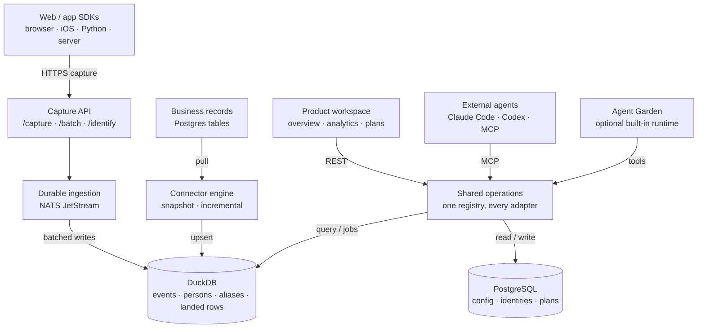

# AgentRay

[English](README.md) · [Tiếng Việt](README.vi.md) · [中文](README.cn.md) · [日本語](README.jp.md) · [한국어](README.kr.md)

**Open-source product analytics that ends in a decision, not a dashboard.**

AgentRay turns product activity and business data into marketing and operational
decisions. Connect a website or app, see a trustworthy product overview, then use
your preferred agent — Claude Code, Codex, or the built-in one — to investigate
and improve it. The wedge is deliberately narrow: **instrument → understand →
choose one measurable improvement.**

Every analytics tool can tell you *what happened*. The work that matters —
*measure → diagnose → test → learn* — usually falls to a human who has no time to
run it, so the loop stalls at the chart. AgentRay ships that loop as the product:
the same event store that draws your charts also answers your agents, from a
one-off product question to a scheduled, unattended growth loop.

Underneath is a complete product-analytics base you can self-host with one
`docker compose up` — Go ingestion, embedded DuckDB, Postgres for the control
plane, PostHog-compatible capture, and SDKs for browser, iOS, Python and server.

## The three layers

| Layer | What it owns |
|---|---|
| **Data** | Capture events; sync business records; maintain identity, schemas, freshness and lineage |
| **Understanding** | Predefined metrics, dashboards, funnels, retention, people, reusable audiences |
| **Decisions and work** | Evidence-backed plans and operational investigations |

Basic analytics and setup work **without a model key and without an installed
agent**. That is a requirement, not a fallback: the deterministic overview, the
dashboards and the SDK verification all run from the event store alone.

## Architecture



The explorable version of this diagram — per-component detail, light and dark
themes — is
[`docs/redesign/architecture.html`](docs/redesign/architecture.html) (source:
[`architecture.json`](docs/redesign/architecture.json), receipt:
[`architecture.receipt.json`](docs/redesign/architecture.receipt.json)). The
product and storage reasoning behind it is
[`docs/redesign/strategy.md`](docs/redesign/strategy.md).

### The code map

The backend is four layers — **channels → workloads → runtime → dataplane** —
plus `internal/shared` and a composition root. The mapping, the import rules and
a `TestLayerImportRules` that enforces them live in
[`docs/ARCHITECTURE.md`](docs/ARCHITECTURE.md).

| Layer | Path | Role |
|---|---|---|
| Channels | `internal/channels` | What starts work: `chat`, `mcp`, `schedule`, `webhook`, `lab` (reserved: `support_widget`, `voice`) |
| Workloads | `internal/workloads` | Agent packs as config only: `validate`, `growth`, `marketing`, `data`, `operator` (reserved: `support`) |
| Runtime | `internal/runtime` | AgentGarden, the `agentcore` loop, policy, sandbox |
| Dataplane | `internal/dataplane` | `ingest` · `connector` · `store` · `usecase` · `alerting` |

`agentcore/` and `sandbox/` stay at the module root as the public runtime
libraries. The Garden's design and the agent-team model are in
[`docs/ARCHITECT-AGENTGARDEN.md`](docs/ARCHITECT-AGENTGARDEN.md) and
[`docs/ARCHITECT-AGENT-TEAM.md`](docs/ARCHITECT-AGENT-TEAM.md).

What is deliberately **not** here: three separate products (growth / ops / CS),
a move of `agentcore`/`sandbox`, or a CDP. It is one runtime, one data plane,
with packs and channels as config and adapters.

## Destinations

The signed-in front door is `/overview` — the deterministic product read, not a
chat box. Navigation names the job a product owner recognizes, not the backend
layer that serves it ([`web/lib/ia.ts`](web/lib/ia.ts)):

| Destination | Job | Also reachable |
|---|---|---|
| **Overview** `/overview` | Understand usage, conversion, retention and data freshness | |
| **Analytics** `/dashboard` | Explore acquisition, engagement, funnels, retention; save dashboards | `/traffic` · `/product` · `/templates` · `/sql` · `/web-analytics` |
| **People** `/persons` | Inspect a person's activity and business attributes; save audiences | `/cohorts` |
| **Data** `/events` | Connect SDKs and sources; inspect events, datasets and pipeline health | `/start` · `/replay` |
| **Plans** `/plans` | Keep findings, evidence, proposed experiments and results | `/prototypes` |
| **Agents** `/agents` | Connect an external agent; chat, operations, Garden, marketplace | `/chat` · `/operations` · `/marketplace` · `/teams` · `/monitor` |
| **Settings** `/settings` | Workspace access, credentials, retention and usage | `/alerts` · `/pricing` (hosted only) |

Every pre-redesign URL still resolves: old top-level items became either an alias
on the new destination or a child surface under it. Nothing redirects away, and
no saved layout moves. A destination whose page does not exist yet renders as a
non-linked "Coming soon" affordance — never a link the router cannot serve.

## Numbers you can trust

The product's load-bearing rule: **a metric with no verified source renders its
state, never a fabricated zero.**

- `Set up` — the capability is uninstrumented; the copy names the required
  instrumentation.
- `Not ready` — the cohort is too immature to answer (a D7 number on day 2).
- `No data` — nothing in the selected range, stated as such.
- `Not available` — the metric cannot be answered as posed, rather than being
  answered wrongly (an unlike-currency comparison has no FX rate behind it).
- `Stale` — last-known figures stay visible, timestamped "As of …", with the
  affected metrics named.

There is exactly one day-boundary convention: the project timezone. Rates never
round a real conversion down to `0%` — 16 of 4,783 is 0.3%, not zero — and a
trend chart carries a textual equivalent. This is enforced in the UI's own
helpers (`formatRate`, `metricTile`) rather than left to each panel.

## One capability layer, every agent

There is **one operation registry**
([`internal/shared/opcore`](internal/shared/opcore), populated by
[`internal/dataplane/usecase/analytics.go`](internal/dataplane/usecase/analytics.go)),
and every surface is a projection of it:

| Adapter | Surface |
|---|---|
| REST | `POST /api/op/<operation>` |
| MCP | `POST /mcp` (JSON-RPC 2.0) |
| In-process agent tools | `opcore.Tools` → `agentcore.Tool` |
| CLI | `agentray <operation> '<json>'` |

Adding an operation therefore adds it to the web app, the MCP server, the
in-app agent, and the CLI at once. The registry covers analytics
(`activity_summary`, `recent_events`, `explore_events`, `persons`, `overview`,
`run_insight`, `run_funnel`, `run_retention`, `run_sql`), dashboards and charts
(`list_dashboards` … `archive_chart`), sources (`test_source`, `preview_source`,
`run_source`, `source_status`, `cancel_source_run`), and Plans
(`submit_recommendation`, `propose_test`, `update_test`, `record_outcome`,
`abandon_test`, `list_findings`, `list_tests`), plus `remember`,
`send_notification` and `verify_sdk`.

### Two credentials, two jobs

A **capture key** feeds events. It cannot run a single operation. Operations
authenticate with a scoped, revocable **management credential** (`agm_…`),
stored only as a SHA-256 hash and shown exactly once at creation.

| Scope | Grants |
|---|---|
| `analytics:read` | summaries, event reads, insights, funnels, retention, dashboard listing, SDK verification |
| `dashboards:write` | dashboard and chart authoring, reorder, archive |
| `sources:read` | probe, preview, status |
| `sources:manage` | create, update, pause, run, cancel (implies `sources:read`) |
| `plans:write` | findings and experiments: submit, propose, update, record outcome, abandon |
| `growth:write` | memory and notification writes (`remember`, `send_notification`) |

Resolution is deterministic and never downgrades: a management credential wins,
then a project API key, then the session cookie — and a `Bearer` that is present
but is not a valid `agm_` credential is **rejected outright** rather than falling
through to a broader identity. New projects are born split, so the capture key is
capture-only from day one. Pre-split ("legacy") projects keep their existing key
for management under a frozen allowlist until
`POST /api/projects/:project_id/credential-split` moves them across — which
requires at least one live credential first, because splitting without one would
brick every key-authenticated client.

## Business data

Events and synced records are kept distinct on purpose. An order row is current
business state; an `order_paid` event is a fact at a point in time. Joining them
without a grain and identity contract is how double counts get built.

The connector engine ([`internal/dataplane/connector`](internal/dataplane/connector))
ships a **PostgreSQL** source. Sync is keyset-paginated and retry-safe:

- **Incremental** — a cursor column plus a primary-key tiebreak, so a run
  resumes where it stopped.
- **Snapshot** — no cursor column: the whole table is re-pulled each run and
  deduplicated by `(project, connector, table, row_key)`. Hitting the batch cap
  reports truncation rather than silently landing a partial table.

Landed rows live in DuckDB's `external_rows` and **ride the same durable stream
as events**, so a blue-green colour switch replays them exactly like events
instead of losing them. Timestamp polling cannot discover hard deletes: a
tombstone feed or periodic reconciliation is required, and CDC is not advertised
until it exists.

## SDKs

Four clients, all at **v0.1.0**, all installable today from GitHub Releases —
no registry account, no auth. `npm install @agentray/browser` and
`pip install agentray` still 404: the `@agentray` npm scope and the `agentray`
PyPI name are unclaimed, so the release attaches the real tarball and wheel
instead. Install those by URL (each section below shows how), or paste the no-npm
snippet, or copy the source into the product repo.

Swift is the exception, and deliberately so: SwiftPM resolves `Package.swift`
from a repository *root*, so the Swift SDK is its own repository,
[lohi-ai/agentray-swift](https://github.com/lohi-ai/agentray-swift), carried here
as a submodule at `sdk/swift/`. Run `git submodule update --init sdk/swift` to
get it; it builds, tests and releases itself.

`make sdk-check` runs every client's tests and builds, and asserts the published
artefact actually contains the code. Cutting a release:
[docs/RELEASING-SDK.md](docs/RELEASING-SDK.md).

**Every SDK stamps a `platform` property** (`web` / `ios` / `android` /
`server`), which is what Traffic's platform split and the per-platform funnel
read. See ["Which app did this come from?"](#which-app-did-this-come-from) below.

**Browser — no npm.** Paste before `</body>` (Framer, Carrd, Webflow, or a
plain HTML file). Source of truth:
`web/modules/start/components/instrument-snippet.tsx`.

```html
<script>
(function () {
  var HOST = 'https://agentray.example.com';
  var KEY  = 'YOUR_PROJECT_API_KEY';
  var id = localStorage.getItem('ar_id');
  if (!id) { id = 'a-' + Math.random().toString(36).slice(2) + Date.now().toString(36); localStorage.setItem('ar_id', id); }
  function send(event, props) {
    fetch(HOST + '/capture', {
      method: 'POST',
      headers: { 'Content-Type': 'application/json' },
      body: JSON.stringify({
        api_key: KEY, event: event, distinct_id: id,
        properties: Object.assign({ '$referrer': document.referrer, '$current_url': location.href }, props || {})
      }),
      keepalive: true
    });
  }
  send('user.pageview', { title: document.title, path: location.pathname });
})();
</script>
```

With a build step, install the published tarball from the latest
[`browser-v*` release](https://github.com/lohi-ai/agentray/releases?q=browser) — `npm install @agentray/browser` once
the npm scope is claimed:

```bash
npm install https://github.com/lohi-ai/agentray/releases/download/browser-v0.1.0/agentray-browser-0.1.0.tgz
```


```ts
import { init } from '@agentray/browser';

const ar = init({ host: 'https://agentray.example.com', apiKey: 'phc_...', autocapture: true });
ar.capture('user.pageview', { path: location.pathname });
ar.identify('user-123', { email: 'alice@example.com' });
```

Autocapture is dependency-free and framework-agnostic: every page reports
pageviews (`user.pageview`, which powers the Web analytics tab), delegated clicks
(`$autocapture`), and `[data-track-view]` visibility (`element_viewed`) with no
per-button wiring. Markup conventions: `data-track="label"` opts an element into
click capture with an explicit label, `data-track-ignore` mutes a subtree, and
`data-track-view="label"` fires `element_viewed` once when the element becomes at
least half visible. See `sdk/browser/README.md`.

**iOS / Apple — `sdk/swift/`.** A Swift Package (SPM), living in its own
repository so SwiftPM can resolve it:
`.package(url: "https://github.com/lohi-ai/agentray-swift.git", from: "0.1.0")`.
Or add it by path, or paste the single-file version from the in-app **iOS app** tab
(Dashboards → Send your first event, or Set up). It exists because a native app
sends the same events through the same key as your website, and three things
must be true for the two to stay comparable: a device id that survives launches,
an `identify` that aliases the anonymous history so one human is not two people,
and a `platform: ios` tag on every event so Traffic and the Product funnel can
separate the audiences. See `sdk/swift/README.md`.

```swift
import AgentRay

AgentRay.start(host: "https://agentray.example.com", apiKey: "agentray_…")
AgentRay.shared.screen("Library")               // sends user.pageview
AgentRay.shared.capture("user.signup", properties: ["plan": "free"])
AgentRay.shared.identify("user_123", traits: ["email": "alice@example.com"])
AgentRay.shared.reset()                          // on logout
```

**Python — `sdk/python/`.** `pip install https://github.com/lohi-ai/agentray/releases/download/python-v0.1.0/agentray-0.1.0-py3-none-any.whl`
(`pip install agentray` once the PyPI name is claimed). Non-blocking server-side capture with a background batch thread;
PostHog-compatible payloads:

```python
from agentray import Client
ar = Client(host="https://agentray.example.com", api_key="phc_...")
ar.capture("order_paid", distinct_id="user-123", properties={"amount": 29})
ar.flush()
```

**Node/Bun server — `sdk/server/`.** `npm install https://github.com/lohi-ai/agentray/releases/download/server-v0.1.0/agentray-server-0.1.0.tgz`
(`@agentray/server` once the npm scope is claimed). Awaitable, idempotent capture for events the browser must not be
trusted to send — payments, subscriptions, refunds:

```ts
import { AgentRayServerClient } from '@agentray/server';
const ar = new AgentRayServerClient({ apiUrl: process.env.AGENTRAY_URL!, apiKey: process.env.AGENTRAY_API_KEY! });
// amount is an integer in the smallest unit of currency (1900 = $19.00), and
// both money methods require a stable idempotency key.
await ar.revenue('user-123', { amount: 1900, currency: 'USD', kind: 'payment' }, { idempotencyKey: webhook.id });
await ar.revenueReversed('user-123', { amount: 1900, currency: 'USD' }, { idempotencyKey: `refund:${refund.id}` });
```

Every SDK speaks the same `capture` / `batch` / `identify` payload, so a
PostHog integration migrates by changing only the host.

### Which app did this come from?

Every event carries a `platform` — `web`, `ios`, `android`, or `server`. Each
SDK states its own, and an explicit `platform` (or PostHog-style `$platform` /
`$os`) property always wins. Only when nothing says does the user agent decide,
so events sent before any of this classify too. Safari on an iPhone is `web`, a
URLSession call from your app is `ios`: the split is by *app*, not by device.

Inference is the fallback, never the contract — a runtime's user agent is not a
stable interface. Node's global `fetch` sends the bare word `node`, so every
server-sent event, revenue included, was landing in "unknown" until the clients
started declaring themselves.

Traffic carries a **By platform** panel (click a row to scope the page),
Product's funnel repeats itself per platform, and the filter bar grows a
**Platform** facet the moment a second one starts sending. In SQL it is a plain
column: `WHERE platform = 'ios'`.

## CLI

`cmd/cli` builds the `agentray` binary (`make cli`, or
`go install github.com/lohi-ai/agentray/cmd/cli@latest`). It is self-serve from
zero — an agent can create an account and fetch a project API key without ever
opening the web app:

```sh
agentray signup --email you@example.com          # account + workspace + project
agentray login  --email you@example.com          # session saved to ~/.agentray
export AGENTRAY_API_KEY=$(agentray key)          # bare key on stdout
agentray key --rotate                            # rotate and print the new key
agentray projects                                # list projects; `whoami`, `logout`
```

Passwords come from `--password`, `AGENTRAY_PASSWORD`, or a hidden prompt. After
login, the saved server URL and project key become the defaults, so every
operation works with zero flags:

```sh
agentray ops                                     # list operations + schemas
agentray activity_summary '{"hours":24}'
agentray run_sql '{"sql":"SELECT count() FROM events"}'
```

`agentray key` deliberately prints the **capture** key, because that is the SDK
flow (`export AGENTRAY_API_KEY=$(agentray key)`) and printing a private scoped
secret into SDK config would be the wrong default. Operations use the management
credential the CLI mints once per project at login and keeps in the same `0600`
config — minting is owner/admin-only, and a member or viewer still logs in, still
gets the capture key, and is told plainly that operations will be refused until
an owner or admin mints a credential.

**The credential is revoked, never abandoned.** Selecting another project
(`agentray key --project <name>`) revokes the credential bound to the project
being left before the new selection replaces it, and `agentray logout` revokes
it before the session — the session is what authorizes the revoke. A revoke is
only believed when the server confirms it: the delete route answers one `403`
for both a refusal and an already-revoked row, so the member-readable credential
list decides. When that proof is missing, the command stops with the credential
still tracked in the config for a retry rather than quietly orphaning a live
key.

## AI Agents & MCP

AgentRay exposes its operations to external AI agents (Claude Code, Codex, any
MCP client) over an **MCP server** at `POST /mcp` — JSON-RPC 2.0, tools only.
The agent can read activity, run funnels/retention/SQL over your events, and pin
dashboards: the same operations the in-app agent and the web client use, with no
second API to learn. `tools/list` advertises only what the calling credential may
invoke, and `tools/call` re-authorizes by name.

**Auth is a management credential, not the capture key.** A capture key is
denied outright, because it would let anyone holding a browser-embedded key
rewrite your dashboards. Mint a scoped `agm_…` credential first (owner/admin;
the secret is shown once):

```sh
curl -X POST https://agentray.lohi2.com/api/projects/$PROJECT_ID/credentials \
  -H 'Content-Type: application/json' --cookie "$SESSION" \
  -d '{"name":"claude-code","scopes":["analytics:read","dashboards:write"]}'
```

Then connect:

```sh
claude mcp add --transport http --header "Authorization: Bearer <agm_…>" \
  agentray https://agentray.lohi2.com/mcp
```

Codex:

```sh
codex mcp add agentray --url https://agentray.lohi2.com/mcp \
  --header "Authorization: Bearer <agm_…>"
```

Self-hosted: swap the host for your instance (e.g. `http://localhost:8088/mcp`).
A signed-in browser session also authenticates, which is how the in-app agent
reaches the same operations without a second credential. A `Bearer` header that
is not an `agm_` credential is rejected rather than downgraded to the session.
A project that predates the credential split can still use its project key here,
under the frozen legacy allowlist.

### Agent Skills

Reusable workflow guides for Claude Code / Codex live in
[`.agents/skills/`](.agents/skills). They teach an agent how to drive the MCP
above:

- `agentray-setup` — integrate an app end to end, in the right order: project +
  API key (web app or `agentray signup`/`key` CLI), SDK install, event
  instrumentation contract, dashboards, agents.
- `agentray-instrument` — design the tracking plan: which events to capture,
  why each earns its place, and the consumer (chart, ask-AI question, SQL,
  alert) planned for every event before it is instrumented.
- `agentray-analytics` — start here for questions; connect, then answer product
  questions from real event data and pin dashboards.
- `agentray-growth-loop` — run one full measure → diagnose → hypothesize →
  recommend → remember cycle: find the weakest funnel link, design the smallest
  reversible test, file it with evidence.
- `agentray-funnel-retention` — build a conversion funnel or retention readout
  and pin it.
- `agentray-incident-triage` — investigate an error spike, latency, or cost
  regression from activity and raw events.

Install them into your agent's skills folder:

```sh
# Claude Code
mkdir -p ~/.claude/skills && cp -R .agents/skills/* ~/.claude/skills/

# Codex
mkdir -p ~/.codex/skills && cp -R .agents/skills/* ~/.codex/skills/
```

## Local Development

[`docs/QUICKSTART.md`](docs/QUICKSTART.md) is the guided path — clone, first real
event, first agent answer, in about 15 minutes. The manual version:

Start the full local stack:

```bash
docker compose up --build -d
```

Services exposed on your machine:

- API: `http://localhost:8088`
- Dashboard web: `http://localhost:3200`
- PostgreSQL: `localhost:5434`
- Redis: `localhost:6389`
- NATS: `localhost:4223`

Default local project token:

```text
lohi_dev_project_token
```

Send a smoke event:

```bash
curl -s http://localhost:8088/capture \
  -H 'Content-Type: application/json' \
  -d '{
    "api_key": "lohi_dev_project_token",
    "event": "agent.tool_call",
    "distinct_id": "local-user",
    "session_id": "session-1",
    "properties": {
      "tool_name": "search",
      "latency_ms": 120,
      "tokens_input": 42,
      "tokens_output": 11
    }
  }'
```

Inspect recent events:

```bash
curl -s 'http://localhost:8088/api/events?api_key=lohi_dev_project_token&limit=10'
```

Inspect recent sessions:

```bash
curl -s 'http://localhost:8088/api/sessions?api_key=lohi_dev_project_token&limit=10'
```

Open the dashboard:

```bash
open http://localhost:3200
```

Run the API or the dashboard app without Docker:

```bash
make dev                                         # Go API with air hot reload
cd web && pnpm install && pnpm dev               # Next.js on :3200
```

## Ingestion

```text
HTTP API → Redis rate limit → NATS JetStream (durable) → batched writer → DuckDB
```

The API returns as soon as the broker acknowledges the message, not when DuckDB
has it — that is what keeps a slow write off the request path. A durable consumer
applies batches, acknowledging only after the write lands, so the consumer's ack
floor *is* the store's position. `POST /capture`, `/batch` and `/identify` are
PostHog-compatible, and both `api_key` and `token` authenticate a project.
Compatibility aliases `/e/`, `/e`, `/i/v0/e/` and `/i/v0/e` are accepted;
the `/i/v0/e*` pair maps to the batch handler, so it expects a `batch` array
rather than a single event.

Every new project (signup, workspace project creation, and the default local
project) is auto-seeded with a "Product overview" dashboard holding four
predefined charts — event trend, top events, sessions, and agent cost — so the
Dashboards tab gives a readable answer before any custom chart is built.

## Storage

| Store | Holds |
|---|---|
| **DuckDB** (embedded, one file per deploy colour) | `events`, `persons`, `aliases`, `external_rows`, `ingest_position`, and a `sessions` view that rolls session aggregates forward as events arrive |
| **PostgreSQL** | Users, sessions, workspaces, projects and API keys, dashboards, charts, saved queries, connectors, agents, Plans |

DuckDB is single-writer MVCC: writes serialize through a one-slot gate, and
reads admit a bounded number of snapshot readers, so a dashboard's parallel tiles
cannot pin the file and a queued reader cannot starve the writer. Untrusted agent
SQL runs in a **separate child process** with its own in-memory database holding
only that project's rows — no files, no network, no credentials — because a
SELECT-only regex is not a tenant boundary.

A daily sweep deletes events older than `EVENT_RETENTION_DAYS` (default 365; `0`
keeps every event). That bounds how long the event log lives, not how large the
file gets: the same file also holds `persons`, `aliases` and connector landing
rows, none of which the sweep touches, so disk capacity still needs watching.

The DuckDB decision itself — including the reproducible comparison harness under
[`storage-evaluation/`](storage-evaluation/) and its explicitly NOT RUN gates —
is recorded in [`docs/redesign/strategy.md`](docs/redesign/strategy.md). The
as-built data path, capture → store → analytics → agent, is
[`docs/DESIGN-DATA-ARCHITECTURE.md`](docs/DESIGN-DATA-ARCHITECTURE.md).

## Deployment

`infra/gce/deploy.sh --env <dev|prod>` rolls the VM blue-green behind Caddy. A
deploy starts the colour that is *not* serving, waits for it to report healthy,
then flips the upstream; a broken build never sees a request, and rollback is
just not flipping.

The healthcheck targets `/readyz`, not `/healthz`, and that gate is a **data
coherence** gate. A fresh colour replays the durable stream on first boot, and
until it has applied every row it answers `503` — because a colour still
replaying would serve queries from a DuckDB file with a hole in it. Each colour
owns its own file and its own durable; a shared file would lock out the incoming
colour and a shared volume would corrupt it. `/readyz` refuses with a reason, and
three of those reasons never clear by waiting (`purged-gap`, `store-behind`,
`stream-mismatch`) — the deploy script's header documents what each means and
what the operator owns.

## End-to-End Test

Run the e2e test from the host machine:

```bash
go test -tags=e2e ./internal/app -run TestAnalyticsServiceE2E -count=1 -v
```

If you run the test from inside a container that talks to the host Docker
daemon, point it back at the host-published ports:

```bash
AGENTRAY_E2E_INFRA_HOST=host.docker.internal \
  go test -tags=e2e ./internal/app -run TestAnalyticsServiceE2E -count=1 -v
```

## Verification

```bash
make check                                       # go vet + the deterministic unit suite
cd web && pnpm test && pnpm lint                  # dashboard app
make sdk-check                                    # browser + server + python + swift
```

`make check` needs no credentials: the real-provider agent tests skip unless
`AGENTRAY_TEST_OPENAI_*` is set (`make test-agents` runs those for real).

## Dependency Baseline

AgentRay targets Go `1.25` and the dependency set verified in the container
build:

- `github.com/duckdb/duckdb-go/v2 v2.10505.0`
- `github.com/jackc/pgx/v5 v5.10.0`
- `github.com/labstack/echo/v4 v4.15.2`
- `github.com/nats-io/nats.go v1.52.0`
- `github.com/redis/go-redis/v9 v9.20.0`
- Next.js `16.1.6`, React `19.2.3`, and Apache ECharts `6.1.0` in `web/`

## Agent runtime as a library

The runtime powering AgentRay's growth loop is exported as two reusable Go
packages you can import on their own:

- [`agentcore`](agentcore/) — a provider-agnostic agent loop (Anthropic or any
  OpenAI-compatible gateway), with progressive-disclosure skills, tool policies,
  budget gating, and context compaction.
- [`sandbox`](sandbox/) — workspace tools (`read_file`, `grep`, `glob`,
  `web_fetch`) for grounding an agent in a repository.

```bash
go get github.com/lohi-ai/agentray@latest
```

[Swatter](https://github.com/lohi-ai/swatter), the validated PR-review bugbot,
is built entirely on these packages.

## License

MIT
