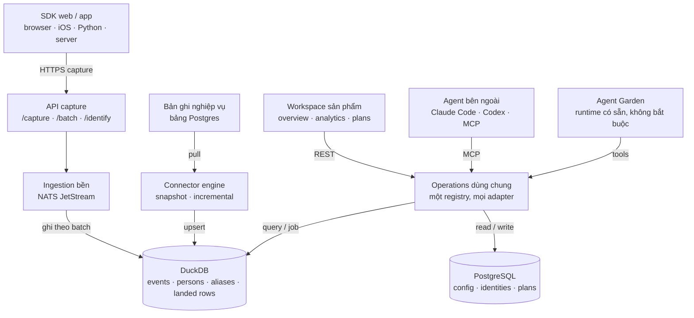

# AgentRay

[English](README.md) · [Tiếng Việt](README.vi.md) · [中文](README.cn.md) · [日本語](README.jp.md) · [한국어](README.kr.md)

**Product analytics mã nguồn mở, kết thúc bằng một quyết định, không phải một dashboard.**

AgentRay biến hoạt động sản phẩm và dữ liệu kinh doanh thành quyết định marketing
và vận hành. Cắm một website hay app vào, xem một product overview đáng tin, rồi
dùng agent bạn thích — Claude Code, Codex, hay con có sẵn trong app — để đào vào
và cải thiện nó. Phạm vi thì cố tình hẹp: **instrument → understand → chọn đúng
một cải thiện đo được.**

Công cụ analytics nào cũng nói được *chuyện gì đã xảy ra*. Còn phần việc đáng giá
— *measure → diagnose → test → learn* — thì thường dồn hết cho một người chẳng có
thời gian chạy nó, nên vòng lặp đứng im ngay chỗ cái chart. AgentRay giao luôn
vòng lặp đó như chính sản phẩm: cùng một event store vẽ chart cho bạn cũng trả lời
agent của bạn, từ một câu hỏi sản phẩm lẻ tẻ tới một growth loop chạy theo lịch,
không cần người ngồi canh.

Bên dưới là một nền tảng product analytics đầy đủ, self-host bằng đúng một lệnh
`docker compose up` — ingestion viết bằng Go, DuckDB nhúng, Postgres cho control
plane, capture tương thích PostHog, và SDK cho browser, iOS, Python với server.

## Ba tầng

| Tầng | Phụ trách gì |
|---|---|
| **Data** | Capture event; sync bản ghi nghiệp vụ; giữ identity, schema, độ mới và lineage |
| **Understanding** | Metric dựng sẵn, dashboard, funnel, retention, people, audience dùng lại được |
| **Decisions and work** | Kế hoạch có bằng chứng và các cuộc điều tra vận hành |

Analytics cơ bản và phần setup chạy được **không cần model key và không cần cài
agent**. Đây là yêu cầu, không phải phương án dự phòng: overview deterministic,
dashboard và cả phần verify SDK đều chỉ chạy trên event store.

## Kiến trúc



Bản tương tác của sơ đồ này — chi tiết từng component, có cả theme sáng và tối —
nằm ở
[`docs/redesign/architecture.html`](docs/redesign/architecture.html) (nguồn:
[`architecture.json`](docs/redesign/architecture.json), receipt:
[`architecture.receipt.json`](docs/redesign/architecture.receipt.json)). Lý do
đằng sau nó về phía sản phẩm và lưu trữ ở
[`docs/redesign/strategy.md`](docs/redesign/strategy.md).

### Bản đồ code

Backend gồm bốn tầng — **channels → workloads → runtime → dataplane** — cộng thêm
`internal/shared` và một composition root. Bảng ánh xạ, luật import và cái
`TestLayerImportRules` canh mấy luật đó nằm ở
[`docs/ARCHITECTURE.md`](docs/ARCHITECTURE.md).

| Tầng | Đường dẫn | Vai trò |
|---|---|---|
| Channels | `internal/channels` | Cái khởi động công việc: `chat`, `mcp`, `schedule`, `webhook`, `lab` (để dành: `support_widget`, `voice`) |
| Workloads | `internal/workloads` | Agent pack chỉ là config: `validate`, `growth`, `marketing`, `data`, `operator` (để dành: `support`) |
| Runtime | `internal/runtime` | AgentGarden, vòng lặp `agentcore`, policy, sandbox |
| Dataplane | `internal/dataplane` | `ingest` · `connector` · `store` · `usecase` · `alerting` |

`agentcore/` và `sandbox/` vẫn nằm ở gốc module, đóng vai thư viện runtime công
khai. Thiết kế của Garden và mô hình agent-team nằm ở
[`docs/ARCHITECT-AGENTGARDEN.md`](docs/ARCHITECT-AGENTGARDEN.md) và
[`docs/ARCHITECT-AGENT-TEAM.md`](docs/ARCHITECT-AGENT-TEAM.md).

Những thứ **cố tình không** có ở đây: ba sản phẩm tách rời (growth / ops / CS),
việc dời `agentcore`/`sandbox` đi chỗ khác, hay một CDP. Chỉ có một runtime, một
data plane, còn pack với channel chỉ là config và adapter.

## Đích đến

Cửa vào sau khi đăng nhập là `/overview` — bản đọc sản phẩm deterministic, không
phải một cái chat box. Menu đặt tên theo việc mà người làm sản phẩm hiểu ngay,
không theo tầng backend phục vụ nó ([`web/lib/ia.ts`](web/lib/ia.ts)):

| Đích đến | Việc | Vào thêm được |
|---|---|---|
| **Overview** `/overview` | Hiểu usage, conversion, retention và độ mới của dữ liệu | |
| **Analytics** `/dashboard` | Khám phá acquisition, engagement, funnel, retention; lưu dashboard | `/traffic` · `/product` · `/templates` · `/sql` · `/web-analytics` |
| **People** `/persons` | Xem hoạt động và thuộc tính nghiệp vụ của một người; lưu audience | `/cohorts` |
| **Data** `/events` | Nối SDK và source; xem event, dataset và sức khỏe pipeline | `/start` · `/replay` |
| **Plans** `/plans` | Giữ finding, bằng chứng, experiment đề xuất và kết quả | `/prototypes` |
| **Agents** `/agents` | Nối một agent bên ngoài; chat, operations, Garden, marketplace | `/chat` · `/operations` · `/marketplace` · `/teams` · `/monitor` |
| **Settings** `/settings` | Quyền vào workspace, credential, retention và usage | `/alerts` · `/pricing` (chỉ bản hosted) |

Mọi URL từ trước đợt redesign vẫn vào được: mục cũ ở cấp cao nhất hoặc thành alias
trên đích đến mới, hoặc thành một màn con nằm dưới nó. Không có gì redirect đi chỗ
khác, và không layout đã lưu nào bị xê dịch. Đích đến nào chưa có trang thì hiện
một chỗ "Coming soon" không phải link — nhất quyết không phải một link mà router
không phục vụ được.

## Những con số đáng tin

Luật chịu lực của sản phẩm: **metric không có nguồn đã verify thì hiện đúng trạng
thái của nó, tuyệt đối không hiện số 0 bịa ra.**

- `Set up` — năng lực này chưa được instrument; câu chữ nói rõ cần instrument cái
  gì.
- `Not ready` — cohort còn quá non để trả lời (số D7 vào ngày thứ 2).
- `No data` — khoảng đã chọn không có gì, và nói thẳng là như vậy.
- `Not available` — metric không trả lời được theo đúng câu hỏi đã đặt, thay vì
  trả lời sai (so sánh hai đơn vị tiền khác nhau thì không có tỷ giá nào đằng sau).
- `Stale` — con số biết được lần cuối vẫn hiện, kèm mốc thời gian "As of …", và
  nêu tên những metric bị ảnh hưởng.

Chỉ có đúng một quy ước mốc ngày: timezone của project. Tỷ lệ không bao giờ làm
tròn một conversion thật xuống `0%` — 16 trên 4,783 là 0.3%, không phải số không —
và chart xu hướng luôn có bản mô tả bằng chữ. Việc này do chính helper của UI lo
(`formatRate`, `metricTile`), chứ không phó mặc cho từng panel.

## Một tầng năng lực, mọi agent

Chỉ có **một operation registry**
([`internal/shared/opcore`](internal/shared/opcore), được
[`internal/dataplane/usecase/analytics.go`](internal/dataplane/usecase/analytics.go)
đổ dữ liệu vào), và mọi cách gọi vào đều chỉ là một phép chiếu của nó:

| Adapter | Cách gọi vào |
|---|---|
| REST | `POST /api/op/<operation>` |
| MCP | `POST /mcp` (JSON-RPC 2.0) |
| Tool của agent chạy trong process | `opcore.Tools` → `agentcore.Tool` |
| CLI | `agentray <operation> '<json>'` |

Nên thêm một operation là thêm luôn cho web app, MCP server, agent trong app và
CLI cùng một lúc. Registry phủ analytics (`activity_summary`, `recent_events`,
`explore_events`, `persons`, `overview`, `run_insight`, `run_funnel`,
`run_retention`, `run_sql`), dashboard và chart (`list_dashboards` …
`archive_chart`), source (`test_source`, `preview_source`, `run_source`,
`source_status`, `cancel_source_run`), và Plans (`submit_recommendation`,
`propose_test`, `update_test`, `record_outcome`, `abandon_test`, `list_findings`,
`list_tests`), cộng thêm `remember`, `send_notification` và `verify_sdk`.

### Hai credential, hai việc

**Capture key** chỉ để đẩy event vào. Nó không chạy nổi một operation nào.
Operation xác thực bằng một **management credential** có scope và thu hồi được
(`agm_…`), chỉ lưu dưới dạng hash SHA-256 và hiện đúng một lần lúc tạo.

| Scope | Cho phép |
|---|---|
| `analytics:read` | summary, đọc event, insight, funnel, retention, liệt kê dashboard, verify SDK |
| `dashboards:write` | tạo và sửa dashboard, chart, đổi thứ tự, archive |
| `sources:read` | probe, preview, status |
| `sources:manage` | create, update, pause, run, cancel (bao hàm luôn `sources:read`) |
| `plans:write` | finding và experiment: submit, propose, update, record outcome, abandon |
| `growth:write` | ghi memory và notification (`remember`, `send_notification`) |

Thứ tự phân giải là deterministic và không bao giờ hạ cấp: management credential
thắng, rồi tới project API key, rồi tới session cookie — và một `Bearer` có mặt
nhưng không phải credential `agm_` hợp lệ thì **bị từ chối thẳng**, chứ không rơi
xuống một identity rộng hơn. Project mới sinh ra là đã tách sẵn, nên capture key
chỉ capture được từ ngày đầu. Project trước thời tách ("legacy") vẫn giữ key cũ để
làm management trong một allowlist đóng băng, cho tới khi
`POST /api/projects/:project_id/credential-split` chuyển chúng qua — mà muốn
chuyển thì phải có sẵn ít nhất một credential còn sống, vì tách mà không có thì
mọi client xác thực bằng key đều chết cứng.

## Dữ liệu nghiệp vụ

Event và bản ghi sync được cố tình tách riêng. Một dòng order là trạng thái nghiệp
vụ hiện tại; một event `order_paid` là sự thật tại đúng một thời điểm. Nối hai thứ
đó mà không có contract về grain và identity chính là cách người ta dựng ra mấy
con số đếm trùng.

Connector engine ([`internal/dataplane/connector`](internal/dataplane/connector))
có sẵn một source **PostgreSQL**. Sync phân trang bằng keyset và an toàn khi retry:

- **Incremental** — một cột cursor cộng thêm primary key làm tiebreak, nên lần
  chạy sau tiếp đúng chỗ đã dừng.
- **Snapshot** — không có cột cursor: mỗi lần chạy kéo lại cả bảng rồi dedupe theo
  `(project, connector, table, row_key)`. Chạm trần batch thì báo là bị cắt, chứ
  không âm thầm land một bảng thiếu.

Row đã land nằm trong `external_rows` của DuckDB và **đi chung stream bền với
event**, nên khi đổi colour blue-green thì chúng được replay y như event, không bị
mất. Poll theo timestamp không phát hiện được hard delete: phải có tombstone feed
hoặc reconcile định kỳ, và CDC sẽ không được quảng cáo cho tới khi nó tồn tại.

## SDK

Bốn client, đều ở **v0.1.0**, đều cài được ngay từ GitHub Releases — không cần
tài khoản registry, không cần auth. `npm install @agentray/browser` và
`pip install agentray` vẫn ra 404: scope npm `@agentray` và tên `agentray` trên
PyPI chưa ai giành, nên release đính kèm thẳng tarball và wheel thật. Cài bằng URL
(mỗi mục bên dưới chỉ cách làm), hoặc dán snippet không cần npm, hoặc copy source
vào repo sản phẩm.

Swift là ngoại lệ, và là ngoại lệ có chủ ý: SwiftPM đọc `Package.swift` từ *gốc*
repository, nên SDK Swift nằm ở repo riêng,
[lohi-ai/agentray-swift](https://github.com/lohi-ai/agentray-swift), ở đây mang
qua dưới dạng submodule tại `sdk/swift/`. Chạy
`git submodule update --init sdk/swift` để lấy về; nó tự build, tự test, tự
release.

`make sdk-check` chạy test và build của mọi client, đồng thời khẳng định artefact
đã publish thật sự chứa code. Khi cắt release:
[docs/RELEASING-SDK.md](docs/RELEASING-SDK.md).

**Mọi SDK đóng dấu một property `platform`** (`web` / `ios` / `android` /
`server`), và đó chính là thứ mà phần chia platform trong Traffic với funnel theo
từng platform đọc vào. Xem ["Event này đến từ app nào?"](#event-này-đến-từ-app-nào)
ở dưới.

**Browser — không cần npm.** Dán trước `</body>` (Framer, Carrd, Webflow, hay một
file HTML thuần). Nguồn chuẩn:
`web/modules/start/components/instrument-snippet.tsx`.

```html
<script>
(function () {
  var HOST = 'https://agentray.example.com';
  var KEY  = 'YOUR_PROJECT_API_KEY';
  var id = localStorage.getItem('ar_id');
  if (!id) { id = 'a-' + Math.random().toString(36).slice(2) + Date.now().toString(36); localStorage.setItem('ar_id', id); }
  function send(event, props) {
    fetch(HOST + '/capture', {
      method: 'POST',
      headers: { 'Content-Type': 'application/json' },
      body: JSON.stringify({
        api_key: KEY, event: event, distinct_id: id,
        properties: Object.assign({ '$referrer': document.referrer, '$current_url': location.href }, props || {})
      }),
      keepalive: true
    });
  }
  send('user.pageview', { title: document.title, path: location.pathname });
})();
</script>
```

Nếu có bước build, cài tarball đã publish từ release
[`browser-v*`](https://github.com/lohi-ai/agentray/releases?q=browser) mới nhất —
`npm install @agentray/browser` khi scope npm đã có chủ:

```bash
npm install https://github.com/lohi-ai/agentray/releases/download/browser-v0.1.0/agentray-browser-0.1.0.tgz
```


```ts
import { init } from '@agentray/browser';

const ar = init({ host: 'https://agentray.example.com', apiKey: 'phc_...', autocapture: true });
ar.capture('user.pageview', { path: location.pathname });
ar.identify('user-123', { email: 'alice@example.com' });
```

Autocapture không phụ thuộc gì và không ràng buộc framework: mọi page tự báo
pageview (`user.pageview`, thứ nuôi tab Web analytics), click qua delegation
(`$autocapture`), và visibility của `[data-track-view]` (`element_viewed`) mà
không phải nối dây từng nút. Quy ước markup: `data-track="label"` cho một element
vào diện capture click kèm label nói rõ, `data-track-ignore` tắt tiếng cả một
subtree, và `data-track-view="label"` bắn `element_viewed` đúng một lần khi
element hiện được ít nhất một nửa. Xem `sdk/browser/README.md`.

**iOS / Apple — `sdk/swift/`.** Một Swift Package (SPM), sống trong repo riêng để
SwiftPM resolve được nó:
`.package(url: "https://github.com/lohi-ai/agentray-swift.git", from: "0.1.0")`.
Hoặc thêm bằng đường dẫn, hoặc dán bản một file từ tab **iOS app** trong app
(Dashboards → Send your first event, hoặc Set up). Nó tồn tại vì một app native
gửi đúng những event đó qua đúng cái key đó như website của bạn, và để hai bên
còn so sánh được với nhau thì phải đúng ba thứ: một device id sống sót qua các lần
mở app, một `identify` alias được đoạn lịch sử ẩn danh để một người không thành
hai, và một tag `platform: ios` trên mọi event để Traffic với funnel bên Product
tách được hai nhóm audience. Xem `sdk/swift/README.md`.

```swift
import AgentRay

AgentRay.start(host: "https://agentray.example.com", apiKey: "agentray_…")
AgentRay.shared.screen("Library")               // sends user.pageview
AgentRay.shared.capture("user.signup", properties: ["plan": "free"])
AgentRay.shared.identify("user_123", traits: ["email": "alice@example.com"])
AgentRay.shared.reset()                          // on logout
```

**Python — `sdk/python/`.** `pip install https://github.com/lohi-ai/agentray/releases/download/python-v0.1.0/agentray-0.1.0-py3-none-any.whl`
(`pip install agentray` khi tên trên PyPI đã có chủ). Capture phía server không
block, có thread gửi batch chạy nền; payload tương thích PostHog:

```python
from agentray import Client
ar = Client(host="https://agentray.example.com", api_key="phc_...")
ar.capture("order_paid", distinct_id="user-123", properties={"amount": 29})
ar.flush()
```

**Node/Bun server — `sdk/server/`.** `npm install https://github.com/lohi-ai/agentray/releases/download/server-v0.1.0/agentray-server-0.1.0.tgz`
(`@agentray/server` khi scope npm đã có chủ). Capture await được, idempotent, dành
cho những event không thể tin browser gửi — payment, subscription, refund:

```ts
import { AgentRayServerClient } from '@agentray/server';
const ar = new AgentRayServerClient({ apiUrl: process.env.AGENTRAY_URL!, apiKey: process.env.AGENTRAY_API_KEY! });
// amount is an integer in the smallest unit of currency (1900 = $19.00), and
// both money methods require a stable idempotency key.
await ar.revenue('user-123', { amount: 1900, currency: 'USD', kind: 'payment' }, { idempotencyKey: webhook.id });
await ar.revenueReversed('user-123', { amount: 1900, currency: 'USD' }, { idempotencyKey: `refund:${refund.id}` });
```

Mọi SDK nói cùng một payload `capture` / `batch` / `identify`, nên tích hợp PostHog
muốn chuyển qua chỉ cần đổi mỗi host.

### Event này đến từ app nào?

Mọi event đều mang một `platform` — `web`, `ios`, `android`, hoặc `server`. Mỗi
SDK tự khai platform của mình, và property `platform` nói rõ (hoặc kiểu PostHog
`$platform` / `$os`) luôn thắng. Chỉ khi không có gì khai thì user agent mới quyết,
nên event gửi trước khi có mấy thứ này vẫn được phân loại. Safari trên iPhone là
`web`, một lệnh URLSession từ app của bạn là `ios`: chia theo *app*, không theo
thiết bị.

Suy đoán chỉ là fallback, không bao giờ là contract — user agent của một runtime
đâu phải interface ổn định. `fetch` toàn cục của Node gửi đúng một chữ `node`, nên
mọi event gửi từ server, kể cả revenue, đều rơi vào "unknown" cho tới khi các
client tự khai tên mình.

Traffic có panel **By platform** (bấm một dòng để scope cả trang), funnel bên
Product tách riêng theo từng platform, và filter bar mọc thêm facet **Platform**
ngay khi platform thứ hai bắt đầu gửi event. Trong SQL nó chỉ là một cột bình
thường: `WHERE platform = 'ios'`.

## CLI

`cmd/cli` build ra binary `agentray` (`make cli`, hoặc
`go install github.com/lohi-ai/agentray/cmd/cli@latest`). Nó tự lo được từ con số
không — một agent có thể tạo account và lấy project API key mà không cần mở web
app:

```sh
agentray signup --email you@example.com          # account + workspace + project
agentray login  --email you@example.com          # session saved to ~/.agentray
export AGENTRAY_API_KEY=$(agentray key)          # bare key on stdout
agentray key --rotate                            # rotate and print the new key
agentray projects                                # list projects; `whoami`, `logout`
```

Mật khẩu lấy từ `--password`, `AGENTRAY_PASSWORD`, hoặc một prompt ẩn. Sau khi
login, server URL và project key đã lưu thành mặc định, nên mọi operation chạy
được mà không cần flag nào:

```sh
agentray ops                                     # list operations + schemas
agentray activity_summary '{"hours":24}'
agentray run_sql '{"sql":"SELECT count() FROM events"}'
```

`agentray key` cố tình in ra **capture** key, vì đó mới là luồng SDK
(`export AGENTRAY_API_KEY=$(agentray key)`), còn in một secret có scope vào config
SDK thì là mặc định sai. Operation dùng management credential mà CLI tạo một lần
cho mỗi project lúc login và giữ trong cùng file config `0600` — chỉ owner/admin
mới tạo được, và member vẫn login được, vẫn lấy được capture key, và
được nói thẳng rằng operation sẽ bị từ chối cho tới khi owner hoặc admin tạo
credential.

**Thu hồi credential, không bỏ rơi nó.** Chọn project khác
(`agentray key --project <name>`) sẽ thu hồi credential gắn với project đang rời
trước khi lựa chọn mới thay chỗ nó, và `agentray logout` thu hồi nó trước phiên —
chính cái phiên mới là thứ cho phép thu hồi. Chỉ tin là đã thu hồi khi server xác
nhận: route delete trả về đúng một `403` cho cả trường hợp bị từ chối lẫn trường
hợp dòng đã thu hồi xong, nên danh sách credential mà member đọc được là thứ quyết
định. Thiếu bằng chứng đó thì lệnh dừng lại, credential vẫn được giữ trong config
để retry, chứ không âm thầm bỏ rơi một key còn sống.

## AI Agent & MCP

AgentRay mở operation của mình cho agent AI bên ngoài (Claude Code, Codex, bất kỳ
MCP client nào) qua một **MCP server** tại `POST /mcp` — JSON-RPC 2.0, chỉ có
tool. Nó đọc được activity, chạy funnel/retention/SQL trên event của bạn, và pin
dashboard: đúng những operation mà agent trong app với web client dùng, không
phải học thêm API thứ hai. `tools/list` chỉ quảng cáo thứ mà credential đang gọi
được phép chạy, và `tools/call` xác thực lại theo tên.

**Auth dùng management credential, không dùng capture key.** Capture key bị từ
chối thẳng, vì nếu không thì ai cầm key nhúng trong browser cũng sửa được dashboard
của bạn. Tạo trước một credential `agm_…` có scope (chỉ owner/admin; secret hiện
đúng một lần):

```sh
curl -X POST https://agentray.lohi2.com/api/projects/$PROJECT_ID/credentials \
  -H 'Content-Type: application/json' --cookie "$SESSION" \
  -d '{"name":"claude-code","scopes":["analytics:read","dashboards:write"]}'
```

Rồi nối vào:

```sh
claude mcp add --transport http --header "Authorization: Bearer <agm_…>" \
  agentray https://agentray.lohi2.com/mcp
```

Codex:

```sh
codex mcp add agentray --url https://agentray.lohi2.com/mcp \
  --header "Authorization: Bearer <agm_…>"
```

Self-hosted: đổi host thành instance của bạn (vd. `http://localhost:8088/mcp`).
Một phiên browser đã đăng nhập cũng xác thực được, đó là cách agent trong app chạm
tới đúng những operation đó mà không cần credential thứ hai. Header `Bearer` không
phải credential `agm_` thì bị từ chối, chứ không bị hạ xuống dùng session. Project
có từ trước đợt tách credential vẫn dùng được project key ở đây, trong allowlist
legacy đóng băng.

### Skill cho agent

Các hướng dẫn workflow dùng lại được cho Claude Code / Codex nằm ở
[`.agents/skills/`](.agents/skills). Tụi nó dạy agent cách điều khiển cái MCP ở
trên:

- `agentray-setup` — tích hợp một app từ đầu tới cuối, đúng thứ tự: project + API
  key (web app hoặc CLI `agentray signup`/`key`), cài SDK, contract instrument
  event, dashboard, agent.
- `agentray-instrument` — thiết kế tracking plan: capture event nào, vì sao từng
  cái đáng có mặt, và người tiêu thụ (chart, câu hỏi cho AI, SQL, alert) đã tính
  trước cho mỗi event trước khi instrument nó.
- `agentray-analytics` — hỏi gì cũng bắt đầu từ đây; nối vào, rồi trả lời câu hỏi
  sản phẩm từ event thật và pin dashboard.
- `agentray-growth-loop` — chạy trọn một vòng measure → diagnose → hypothesize →
  recommend → remember: tìm mắt yếu nhất của funnel, thiết kế test nhỏ nhất còn
  lật ngược được, và ghi lại kèm bằng chứng.
- `agentray-funnel-retention` — dựng một conversion funnel hoặc bản đọc retention
  rồi pin lại.
- `agentray-incident-triage` — điều tra một đợt lỗi tăng vọt, latency, hay cost đi
  lùi, từ activity và raw event.

Cài vào thư mục skills của agent bạn:

```sh
# Claude Code
mkdir -p ~/.claude/skills && cp -R .agents/skills/* ~/.claude/skills/

# Codex
mkdir -p ~/.codex/skills && cp -R .agents/skills/* ~/.codex/skills/
```

## Chạy thử ở máy

[`docs/QUICKSTART.md`](docs/QUICKSTART.md) là đường có hướng dẫn sẵn — clone,
event thật đầu tiên, câu trả lời đầu tiên của agent, trong khoảng 15 phút. Còn
đây là bản làm tay:

Dựng cả stack local:

```bash
docker compose up --build -d
```

Các service mở ra trên máy bạn:

- API: `http://localhost:8088`
- Dashboard web: `http://localhost:3200`
- PostgreSQL: `localhost:5434`
- Redis: `localhost:6389`
- NATS: `localhost:4223`

Token project local mặc định:

```text
lohi_dev_project_token
```

Gửi thử một smoke event:

```bash
curl -s http://localhost:8088/capture \
  -H 'Content-Type: application/json' \
  -d '{
    "api_key": "lohi_dev_project_token",
    "event": "agent.tool_call",
    "distinct_id": "local-user",
    "session_id": "session-1",
    "properties": {
      "tool_name": "search",
      "latency_ms": 120,
      "tokens_input": 42,
      "tokens_output": 11
    }
  }'
```

Xem event gần đây:

```bash
curl -s 'http://localhost:8088/api/events?api_key=lohi_dev_project_token&limit=10'
```

Xem session gần đây:

```bash
curl -s 'http://localhost:8088/api/sessions?api_key=lohi_dev_project_token&limit=10'
```

Mở dashboard:

```bash
open http://localhost:3200
```

Chạy API hoặc app dashboard mà không cần Docker:

```bash
make dev                                         # Go API with air hot reload
cd web && pnpm install && pnpm dev               # Next.js on :3200
```

## Ingestion

```text
HTTP API → Redis rate limit → NATS JetStream (durable) → batched writer → DuckDB
```

API trả về ngay khi broker nhận message, chứ không đợi DuckDB có nó — chính vậy
mới giữ được một lượt ghi chậm ra khỏi đường đi của request. Một durable consumer
áp batch, chỉ ack sau khi lượt ghi đã land, nên mức ack của consumer *chính là* vị
trí của store. `POST /capture`, `/batch` và `/identify` tương thích PostHog, và cả
`api_key` lẫn `token` đều xác thực được một project. Alias tương thích `/e/`,
`/e`, `/i/v0/e/` và `/i/v0/e` đều nhận; cặp `/i/v0/e*` map vào handler batch, nên
nó chờ một mảng `batch` chứ không phải một event đơn.

AgentRay seed sẵn cho mọi project mới (signup, tạo project trong workspace, và cả
project local mặc định) một dashboard "Product overview" với bốn chart dựng sẵn —
event trend, top event, session, và cost của agent — nên tab Dashboards đã có câu
trả lời đọc được trước khi bạn dựng chart riêng nào.

## Lưu trữ

| Store | Chứa gì |
|---|---|
| **DuckDB** (nhúng, một file cho mỗi colour khi deploy) | `events`, `persons`, `aliases`, `external_rows`, `ingest_position`, và một view `sessions` cuộn session aggregate tới khi event về |
| **PostgreSQL** | User, session, workspace, project và API key, dashboard, chart, query đã lưu, connector, agent, Plans |

DuckDB là MVCC một writer: ghi thì xếp hàng qua một gate một slot, còn đọc thì cho
vào một số lượng snapshot reader có giới hạn, nên mấy tile chạy song song của một
dashboard không giữ được file lại, và một reader đang chờ cũng không bỏ đói writer.
SQL của agent — thứ không đáng tin — chạy trong một **process con riêng** với
database in-memory của chính nó, chỉ chứa row của project đó: không file, không
network, không credential — vì một regex chỉ cho SELECT đâu phải ranh giới tenant.

Một lượt quét hằng ngày xoá event cũ hơn `EVENT_RETENTION_DAYS` (mặc định 365; `0`
là giữ hết). Nó giới hạn event log sống được bao lâu, chứ không giới hạn file lớn
cỡ nào: cùng file đó còn chứa `persons`, `aliases` và row landing của connector, mà
lượt quét không đụng tới, nên dung lượng đĩa vẫn phải để mắt.

Bản thân quyết định chọn DuckDB — kể cả harness so sánh chạy lại được trong
[`storage-evaluation/`](storage-evaluation/) và những gate ghi rõ là NOT RUN của
nó — được ghi ở [`docs/redesign/strategy.md`](docs/redesign/strategy.md). Còn
đường đi dữ liệu thực tế, capture → store → analytics → agent, nằm ở
[`docs/DESIGN-DATA-ARCHITECTURE.md`](docs/DESIGN-DATA-ARCHITECTURE.md).

## Deploy

`infra/gce/deploy.sh --env <dev|prod>` roll VM theo kiểu blue-green sau Caddy. Một
lần deploy dựng colour đang *không* phục vụ lên, đợi nó báo healthy, rồi lật
upstream; một bản build hỏng không bao giờ thấy request nào, và rollback chỉ đơn
giản là không lật.

Healthcheck nhắm vào `/readyz`, không phải `/healthz`, và cái gate đó là gate
**dữ liệu có khớp không**. Một colour mới sẽ replay stream bền ngay lần boot đầu,
và tới khi áp hết mọi row thì nó trả `503` — vì một colour còn replay mà đi phục
vụ query thì trả lời từ một file DuckDB đang thủng lỗ. Mỗi colour có file riêng và
durable riêng; dùng chung file thì colour đang vào bị khoá, dùng chung volume thì
file hỏng. `/readyz` từ chối kèm lý do, và ba trong số lý do đó không bao giờ tự
hết bằng cách ngồi chờ (`purged-gap`, `store-behind`, `stream-mismatch`) — phần
header của script deploy ghi rõ từng cái nghĩa là gì và operator phải lo gì.

## Test end-to-end

Chạy test e2e từ máy host:

```bash
go test -tags=e2e ./internal/app -run TestAnalyticsServiceE2E -count=1 -v
```

Nếu bạn chạy test từ trong container nói chuyện với Docker daemon của host, thì
trỏ nó về đúng cổng mà host publish ra:

```bash
AGENTRAY_E2E_INFRA_HOST=host.docker.internal \
  go test -tags=e2e ./internal/app -run TestAnalyticsServiceE2E -count=1 -v
```

## Kiểm tra

```bash
make check                                       # go vet + the deterministic unit suite
cd web && pnpm test && pnpm lint                  # dashboard app
make sdk-check                                    # browser + server + python + swift
```

`make check` không cần credential: mấy test agent với provider thật sẽ skip trừ
khi đặt `AGENTRAY_TEST_OPENAI_*` (`make test-agents` chạy thật mấy cái đó).

## Baseline dependency

AgentRay nhắm tới Go `1.25` và bộ dependency đã verify trong bản build bằng
container:

- `github.com/duckdb/duckdb-go/v2 v2.10505.0`
- `github.com/jackc/pgx/v5 v5.10.0`
- `github.com/labstack/echo/v4 v4.15.2`
- `github.com/nats-io/nats.go v1.52.0`
- `github.com/redis/go-redis/v9 v9.20.0`
- Next.js `16.1.6`, React `19.2.3`, và Apache ECharts `6.1.0` trong `web/`

## Runtime của agent dưới dạng thư viện

Runtime đang chạy growth loop của AgentRay được đóng gói thành hai Go package dùng
lại được, bạn import riêng cũng được:

- [`agentcore`](agentcore/) — một agent loop không phụ thuộc provider (Anthropic
  hay bất kỳ gateway tương thích OpenAI nào), có skill theo kiểu progressive
  disclosure (tiết lộ dần), policy cho tool, gate budget, và compaction context.
- [`sandbox`](sandbox/) — bộ tool làm việc trong workspace (`read_file`, `grep`,
  `glob`, `web_fetch`) để agent bám vào một repository.

```bash
go get github.com/lohi-ai/agentray@latest
```

[Swatter](https://github.com/lohi-ai/swatter), con bugbot review PR đã được kiểm
chứng, dựng hoàn toàn trên mấy package này.

## Giấy phép

MIT
